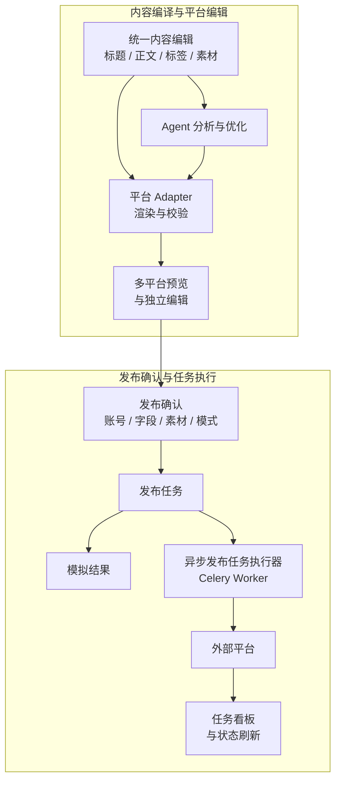
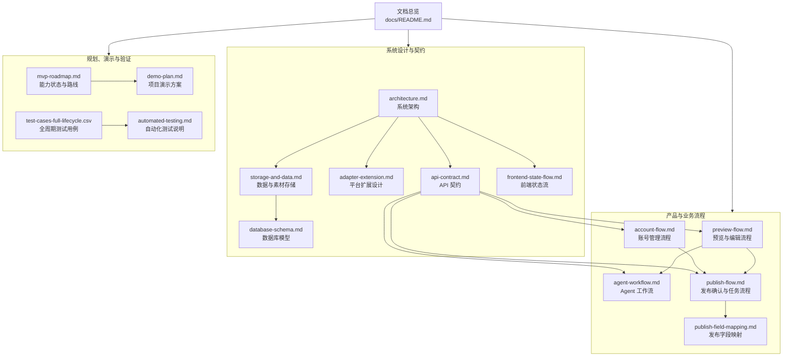

# Auto_Upt 文档总览

> 本文是 `docs/` 的总入口，用于说明项目文档之间的关系、推荐阅读顺序和功能变更时需要同步维护的文档。

## 1. 项目全局链路

Auto_Upt 围绕“一份统一内容，多平台适配，人工确认后发布”组织业务流程：

业务界面由三个可回退的流程节点组成：

1. **统一内容编译**：维护内容和素材，选择生成平台。
2. **编辑所选平台**：查看并修改平台草稿，执行 Agent 优化。
3. **发布确认**：检查账号、最终字段和素材，创建模拟或真实发布任务。

## 2. 文档关系

## 3. 推荐阅读路径

### 产品或体验评审

1. [MVP 路线](./mvp-roadmap.md)：了解当前已实现能力与后续范围。
2. [生成预览流程](./preview-flow.md)：了解统一编辑、平台选择和平台草稿编辑。
3. [Agent 工作流](./agent-workflow.md)：了解智能优化能力及安全边界。
4. [发布确认流程](./publish-flow.md)：了解账号、发布模式、任务与状态。
5. [项目演示方案](./demo-plan.md)：按完整链路进行演示。

### 前端开发

1. [系统架构](./architecture.md)：了解前端工作台结构与全局数据流。
2. [生成预览流程](./preview-flow.md)：了解流程节点和预览交互。
3. [账号管理流程](./account-flow.md)：了解账号配置与状态同步。
4. [发布确认字段映射](./publish-field-mapping.md)：了解最终表单、回退链和素材映射。
5. [API 契约](./api-contract.md)：确认请求、响应和接口边界。
6. [数据与素材存储设计](./storage-and-data.md)：了解浏览器素材与后端发布素材的边界。
7. [前端状态流](./frontend-state-flow.md)：了解 `App.vue` 状态所有权、流程切换和同步规则。

### 后端与平台 Adapter 开发

1. [系统架构](./architecture.md)：了解服务、任务、Agent 和 Adapter 边界。
2. [API 契约](./api-contract.md)：了解当前对外接口。
3. [平台扩展设计](./adapter-extension.md)：了解新增平台约定。
4. [发布确认字段映射](./publish-field-mapping.md)：了解 Adapter 接收的字段与素材。
5. [发布确认流程](./publish-flow.md)：了解同步模拟和异步真实任务。
6. [数据库模型说明](./database-schema.md)：了解表、快照、真实外键和逻辑引用。

### 测试与交付

1. [MVP 路线](./mvp-roadmap.md)：确认已实现和未实现范围。
2. [全周期测试用例](./test-cases-full-lifecycle.csv)：查看功能场景与预期结果。
3. [自动化测试说明](./automated-testing.md)：执行默认、部署环境和真实平台隔离测试。
4. [项目演示方案](./demo-plan.md)：验证演示环境和关键链路。

## 4. 文档职责

| 文档 | 主要回答的问题 | 主要维护者 |
|---|---|---|
| [系统架构](./architecture.md) | 系统由哪些模块组成，模块边界和数据流是什么？ | 前后端、架构 |
| [API 契约](./api-contract.md) | 当前有哪些接口，请求与响应如何约定？ | 后端、前端 |
| [生成预览流程](./preview-flow.md) | 用户如何从统一编辑进入多平台预览和独立编辑？ | 前端、产品 |
| [Agent 工作流](./agent-workflow.md) | Agent 如何分析、改写、调用工具与降级？ | Agent、后端 |
| [账号管理流程](./account-flow.md) | 账号如何配置、保存、同步和用于发布确认？ | 前后端 |
| [发布确认流程](./publish-flow.md) | 用户如何创建发布任务，任务如何执行和刷新？ | 前后端、产品 |
| [发布确认字段映射](./publish-field-mapping.md) | 最终字段和素材从哪里来，如何传给 Adapter？ | 前后端、Adapter |
| [平台扩展设计](./adapter-extension.md) | 如何新增平台并保持核心服务解耦？ | 后端、Adapter |
| [数据与素材存储设计](./storage-and-data.md) | 浏览器素材、后端文件、数据库和 Redis 分别保存什么？ | 前后端、运维 |
| [数据库模型说明](./database-schema.md) | 核心表如何关联，哪些是外键或逻辑引用？ | 后端、数据库 |
| [前端状态流](./frontend-state-flow.md) | 工作区、流程阶段、草稿、素材和任务状态如何流转？ | 前端 |
| [MVP 路线](./mvp-roadmap.md) | 哪些能力已实现、部分实现或待实现？ | 项目维护者 |
| [项目演示方案](./demo-plan.md) | 如何准备并演示完整业务链路？ | 产品、测试 |
| [自动化测试说明](./automated-testing.md) | 自动化测试如何分层和执行？ | 测试、开发 |
| [全周期测试用例](./test-cases-full-lifecycle.csv) | 哪些业务场景需要被验证？ | 测试、产品 |

## 5. 功能变更时的文档联动

| 变更类型 | 至少检查并更新 |
|---|---|
| 新增或修改 API | `api-contract.md`、对应业务流程文档；涉及模块边界时更新 `architecture.md` |
| 修改预览、流程节点或回退规则 | `preview-flow.md`、`demo-plan.md`；影响接口时更新 `api-contract.md` |
| 修改前端全局状态、页面导航或组件状态所有权 | `frontend-state-flow.md`、对应业务流程文档 |
| 修改 Agent 工具、超时、降级或持久化 | `agent-workflow.md`、`api-contract.md`、`architecture.md` |
| 修改账号配置或连接状态 | `account-flow.md`、`publish-flow.md`、`api-contract.md` |
| 修改发布表单、字段回退或素材要求 | `publish-field-mapping.md`、`publish-flow.md`、`api-contract.md` |
| 新增平台或修改 Adapter 能力 | `adapter-extension.md`、`architecture.md`、`mvp-roadmap.md`、发布相关文档 |
| 修改素材持久化、目录或公开 URL | `storage-and-data.md`、`database-schema.md`、`api-contract.md` |
| 修改数据库模型、外键或迁移 | `database-schema.md`、`architecture.md`、对应业务流程和 API 文档 |
| 完成或取消规划能力 | `mvp-roadmap.md`、`README.md`、对应设计和流程文档 |
| 新增测试场景或自动化脚本 | `test-cases-full-lifecycle.csv`、`automated-testing.md` |

## 6. 文档约定

- 文档描述当前实际实现；未完成能力必须明确标注为“待补齐”“联调中”或“暂不支持”。
- 流程文档侧重用户操作和前后端协作，字段文档侧重具体数据来源与回退规则。
- API、平台能力和发布限制以代码实现为准；发现差异时应同步修正文档或记录已知差异。
- Mermaid 图用于表达模块关系、流程和时序，复杂字段细节使用表格说明。
- 新增 `docs/` 文档后，应在本总览的关系图、职责表和适用阅读路径中增加入口。
