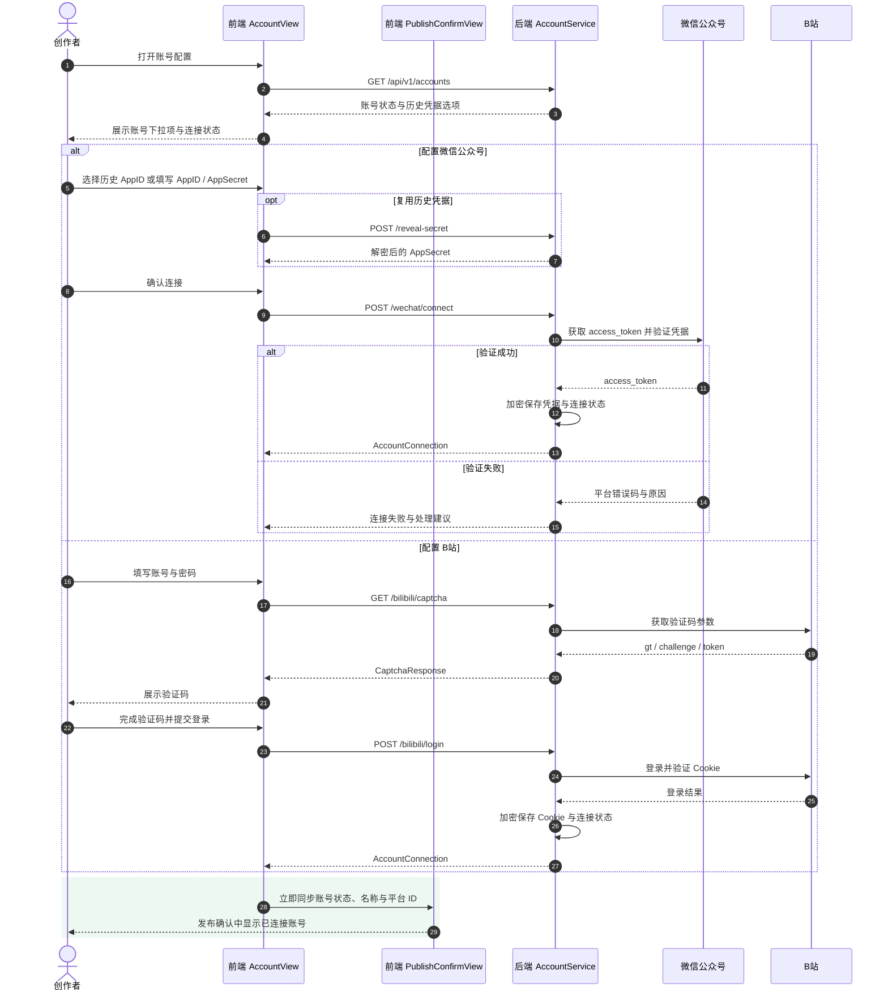

# 账号登录 —— 业务流程图

> 描述用户在各平台配置账号、验证凭据、管理连接状态的前后端通讯过程。
> 当前公众号（AppID/AppSecret）和 B站（用户名+极验）已实现；知乎、小红书待第三阶段。

---

## 泳道图

---

## 步骤详解

### Step 1：页面初始化

`AccountView` 挂载时请求 `GET /api/v1/accounts`，后端查询各平台最新账号记录并返回状态（connected / disconnected / placeholder）。公众号额外返回历史 AppID 列表供快速选择。

### Step 2：公众号连接

用户输入 AppID 时，前端自动匹配历史记录。若匹配到且未填 AppSecret，调用 `POST /reveal-secret` 从加密存储读取自动填充。

提交 `POST /wechat/connect` 后，后端：
1. 若复用历史凭据则解密读取 AppSecret。
2. 调用微信 `get_access_token` 验证凭据有效性。
3. 将 `{app_id, app_secret, access_token}` 以 AES-256-GCM 加密存入数据库。
4. 返回连接结果，前端更新卡片为「已连接」。

### Step 3：B站登录

B站登录需三步交互：

| 步骤 | 请求 | 说明 |
|------|------|------|
| ① 获取验证码 | `GET /bilibili/captcha` | 后端请求 B站获取 `{gt, challenge, token}` |
| ② 极验验证 | 前端 SDK | 加载极验滑块，用户完成验证，获得 `{challenge, validate, seccode}` |
| ③ 提交登录 | `POST /bilibili/login` | 后端获取 RSA 公钥 → 加密密码 → 提交 B站 → 返回 Cookie → 加密入库 |

登录成功后前端重置密码字段和验证码。

### Step 4：测试连接

已连接账号可随时验证凭据是否仍然有效：`POST /{platform}/test`。后端解密凭据后调用对应平台 API（公众号 `get_access_token` / B站 `nav_info`），返回验证结果并更新账号状态。

### Step 5：断开连接

`DELETE /api/v1/accounts/{id}` 删除账号记录，前端重置卡片为「未连接」。公众号还会清除已保存的历史凭据选项。

---

## 各平台账号支持情况

| 功能 | 公众号 | B站 | 知乎 | 小红书 |
|------|:---:|:---:|:---:|:---:|
| 连接方式 | AppID/AppSecret | 用户名+极验 | 第三阶段 | 第三阶段 |
| 凭据加密 | ✅ AES-256-GCM | ✅ AES-256-GCM | ❌ | ❌ |
| 历史凭据复用 | ✅ 自动填充 | — | — | — |
| 连接测试 | ✅ | ✅ | ❌ | ❌ |
| Token 过期管理 | ✅ 过期前刷新 | ❌ | — | — |
| 主动断开 | ✅ | ✅ | ❌ | ❌ |

---

## 关键设计决策

| 决策 | 原因 |
|------|------|
| AppSecret/Cookie 加密存储 | 凭据安全第一，不可明文入库 |
| 公众号历史凭据自动填充 | 降低重复输入 AppSecret 的摩擦 |
| 连接时默认验证 | 确保保存的凭据立即可用 |
| B站同平台仅保留最新记录 | Cookie 为唯一活跃凭据，避免多账号冲突 |
| 知乎/小红书待第三阶段 | 无官方发布 API，需浏览器自动化辅助 |

---

> **相关文档**：[生成预览流程图](./preview-flow.md) · [发布确认流程图](./publish-flow.md) · [API 契约](./api-contract.md) · [架构设计](./architecture.md)
