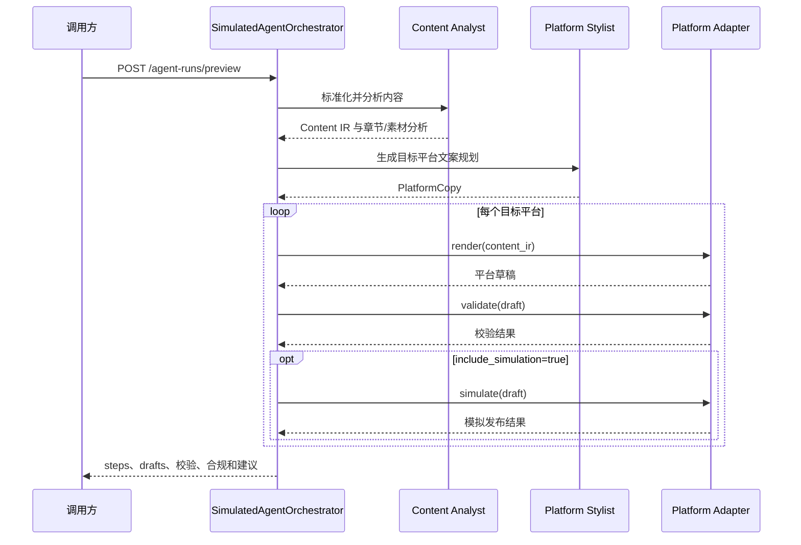
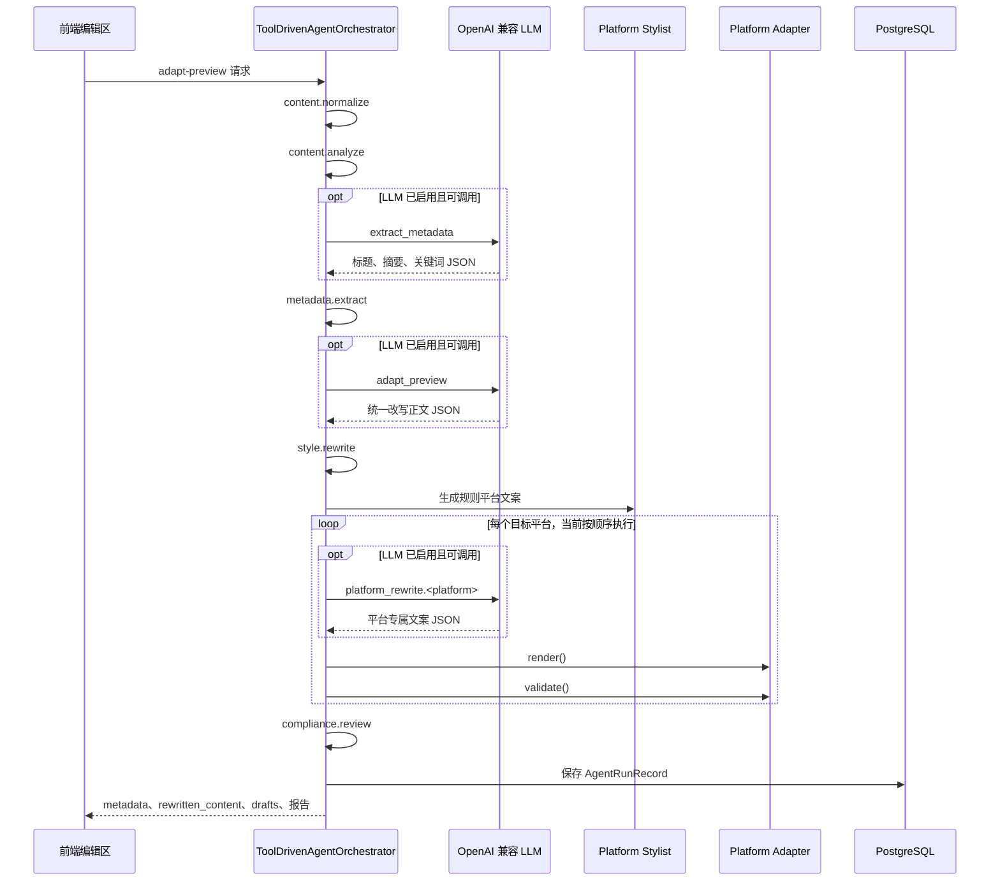

# AI Agent 工作流

本文档描述 Auto_Upt 当前已经实现的 Agent 链路、LLM 调用策略、前端调用方式、数据持久化边界和发布安全边界。

当前 Agent 的职责是分析、改写、生成平台草稿、校验和给出建议。Agent 不会绕过用户确认直接执行真实发布。

## 1. 当前实现概览

后端提供两条 Agent 链路：

| 链路 | 接口 | 是否调用 LLM | 是否写入运行记录 | 是否真实发布 |
|---|---|:---:|:---:|:---:|
| 规则模拟编排 | `POST /api/v1/agent-runs/preview` | 否 | 否 | 否，仅可选模拟 |
| 工具驱动适配 | `POST /api/v1/agent-runs/adapt-preview` | 按配置 | 是 | 否 |

辅助接口：

- `GET /api/v1/agent-runs/tools`：查询工具白名单和工具结构。
- `GET /api/v1/agent-runs/llm-health`：检查 LLM 配置和端点连通性。
- `GET /api/v1/agent-runs/{run_id}`：查询已经保存的工具驱动运行详情。

真实发布属于后续人工确认链路：

```text
Agent 生成平台草稿
  -> 用户检查并编辑平台内容
  -> 用户进入发布确认
  -> 用户选择账号、素材和发布模式
  -> 创建发布任务
  -> 异步发布任务执行器（Celery Worker）调用平台 Adapter
```

## 2. Agent 角色

当前代码通过编排器、规则服务和平台 Adapter 实现以下逻辑角色：

| 角色 | 当前职责 | 当前实现位置 |
|---|---|---|
| Content Analyst | 分析章节、摘要、内容类型、标签和素材 | `backend/app/agents/content_analyst.py` |
| Platform Stylist | 生成各平台结构和表达建议 | `backend/app/agents/platform_stylist.py` |
| Metadata Editor | 提取或生成标题、摘要和关键词 | `ToolDrivenAgentOrchestrator._extract_metadata()` |
| Content Rewriter | 按目标结构、强度和文字风格改写正文 | `ToolDrivenAgentOrchestrator._rewrite_content()` |
| Format Linter | 调用 Adapter 和媒体规则检查平台草稿 | `platform.validate` |
| Compliance Reviewer | 生成合规提示和人工复核建议 | `compliance.review` |
| Publisher Agent | 旧模拟链路中执行 Adapter 模拟发布 | `SimulatedAgentOrchestrator` |
| Recovery Agent | 旧模拟链路中根据校验和合规结果生成建议 | `SimulatedAgentOrchestrator` |

Publisher Agent 和 Recovery Agent 当前不负责自动恢复或真实平台发布。

## 3. 规则模拟编排

`POST /api/v1/agent-runs/preview` 用于无外部依赖的模拟流程。该接口不访问真实模型、不访问账号、不写入数据库。



响应中的 `steps` 会展示内容分析、平台风格规划、草稿渲染、格式校验、合规检查、模拟发布和恢复建议。整体 `mode` 固定为 `simulate`。

## 4. 工具驱动适配编排

`POST /api/v1/agent-runs/adapt-preview` 是前端智能优化实际使用的接口。

### 4.1 执行顺序



一次多平台请求最多可能产生：

```text
1 次 metadata.extract LLM 请求
+ 1 次统一 style.rewrite LLM 请求
+ N 次平台专属改写请求
```

其中 `N` 为目标平台数量。当前平台专属 LLM 请求按平台顺序执行，没有并行调用。

### 4.2 实际工具轨迹

`tool_calls` 当前记录以下实际执行工具：

1. `content.normalize`
2. `content.analyze`
3. `metadata.extract`
4. `style.rewrite`
5. `platform.render`
6. `platform.validate`
7. `compliance.review`

工具注册表还声明了 `title.generate` 和 `keywords.generate`，但当前 `adapt-preview` 主流程不会单独调用这两个工具。标题与关键词逻辑由 `metadata.extract` 统一处理。

平台专属 LLM 改写发生在 `platform.render` 之前，当前不会为每个平台单独生成一条 `tool_calls` 记录。

## 5. 请求参数

`AgentAdaptPreviewRequest` 继承统一内容输入字段：

- `title`：统一标题，可为空。
- `body`：正文，必填。
- `content_type`：`article`、`video` 或 `mixed`。
- `tags`：关键词列表。
- `assets`：关联素材。
- `content_blocks`：正文文本块与素材引用块。
- `cover_asset_id`：封面素材 ID。

Agent 专属字段：

| 字段 | 可选值/默认值 | 行为 |
|---|---|---|
| `platforms` | 默认全部平台 | 指定需要适配的平台 |
| `style_goal` | `professional` | 控制正文结构目标，可选 `professional`、`knowledge`、`social`、`video`、`original` |
| `rewrite_strength` | `medium` | 可选 `light`、`medium`、`strong` |
| `writing_style` | `default` | 控制文字表达，可选 `default`、`professional`、`concise`、`vivid`、`custom` |
| `custom_writing_style` | `null` | 自定义文字风格描述，最多 300 字 |
| `update_title` | `false` | 是否允许修改已有标题 |
| `update_tags` | `false` | 是否允许修改已有关键词 |
| `overwrite_existing_metadata` | `false` | 兼容字段，等同于允许同时修改标题和关键词 |
| `use_llm` | `auto` | 可选 `auto`、`enabled`、`disabled` |
| `preview_id` | `null` | 关联已有预览 ID |
| `persist_preview` | `true` | 预览持久化意图字段，当前实现限制见第 9 节 |

### 5.1 标题与关键词保护

默认情况下，Agent 不会覆盖用户已经填写的标题和关键词：

```text
已有标题 + update_title=false -> 保留原标题
空标题                         -> Agent 可补全标题
已有关键词 + update_tags=false -> 保留原关键词
空关键词                       -> Agent 可补全关键词
```

`overwrite_existing_metadata=true` 等同于同时允许覆盖标题和关键词。

### 5.2 结构目标与文字风格

`style_goal` 和 `writing_style` 是两类不同控制项：

- `style_goal` 控制内容组织目标，例如知识型结构、社交表达或视频简介结构。
- `writing_style` 控制文字语气，例如专业、简洁、生动或用户自定义。

当 `writing_style=default` 时，每个平台使用自己的默认文字风格指导。用户选择预设或自定义文字风格时，该文字风格优先于平台默认语气，但不能改变平台结构和事实准确要求。

## 6. LLM 使用与异常策略

### 6.1 启用条件

| 条件 | 行为 |
|---|---|
| `use_llm=disabled` | 不调用 LLM，完全使用规则结果 |
| 未配置 `OPENAI_API_KEY` | 不调用 LLM，完全使用规则结果 |
| `use_llm=auto` 且已配置密钥 | 尝试调用 LLM |
| `use_llm=enabled` 且已配置密钥 | 当前与 `auto` 行为相同 |

当前 `enabled` 不会在缺少 API Key 时强制报错，也不会保证所有步骤必须使用 LLM。

### 6.2 超时和降级

Agent LLM 请求超时由 `AGENT_LLM_TIMEOUT_SECONDS` 控制，Docker Compose 默认值为 12 秒。

当前异常策略：

| 异常类型 | 当前行为 |
|---|---|
| 单次请求超时 | 当前步骤使用规则结果；后续 LLM 步骤仍继续尝试 |
| HTTP 错误 | 当前步骤使用规则结果；本次运行停止后续 LLM 请求 |
| 连接错误或其他异常 | 当前步骤使用规则结果；本次运行停止后续 LLM 请求 |
| LLM 返回无效 JSON | 当前步骤使用规则结果；本次运行停止后续 LLM 请求 |

停止后续 LLM 请求只影响本次 Agent 运行，不影响后续新的 Agent 请求。

### 6.3 `llm_status`

| 状态 | 含义 |
|---|---|
| `disabled` | 未配置 API Key，或请求主动禁用 LLM |
| `available` | 至少一次 LLM 调用成功；仅发生超时时当前也会显示为 available |
| `degraded` | 发生明确 HTTP、连接、解析或其他错误，并回退到规则结果 |

`GET /api/v1/agent-runs/llm-health` 只检查配置和端点连通性，不保证后续长文本生成一定成功。

## 7. 草稿生成优先级

每个平台草稿生成时按照以下优先级选择内容：

```text
有效的平台专属 LLM 文案
  -> 规则 Platform Stylist 文案
  -> 统一 Content IR
  -> Platform Adapter 渲染
```

最终仍由 Platform Adapter 负责平台字段、素材槽、富文本结构和校验规则。核心编排器不直接硬编码平台发布限制。

如果用户没有允许修改标题或关键词，平台专属 LLM 和规则 Platform Stylist 都不能覆盖已有值。

## 8. 前端调用方式

当前前端智能优化位于“编辑所选平台”流程。

### 8.1 单平台优化

单平台优化会：

1. 使用统一编辑区内容和当前平台构建请求。
2. 调用一次 `adapt-preview`，其中 `platforms` 只包含当前平台。
3. 使用 Agent 对应平台草稿重新创建普通预览。
4. 合并回当前平台，不修改其他平台草稿。

### 8.2 一键优化

一键优化并不是一次请求生成全部平台，而是前端按所选平台串行执行单平台优化：

```text
for platform in selectedPlatforms:
    调用 adapt-preview(platform)
    创建普通预览
合并每个平台结果
```

因此，一键优化耗时随平台数量增加。每次单平台请求内部仍可能调用元数据、统一改写和平台专属改写 LLM。

### 8.3 素材保护

前端应用 Agent 草稿时会检查正文素材标记。如果 Agent 输出遗漏原正文中的素材标记，前端会将缺失标记追加回生成正文，避免优化后素材引用直接丢失。

### 8.4 前置条件

- 单平台优化要求正文和当前平台预览已存在。
- 一键优化要求正文有效且至少选择一个平台。
- 不满足条件时，前端按钮禁用并展示具体悬浮提示。

## 9. 输出与持久化

`adapt-preview` 返回：

- `run_id`：Agent 运行 ID。
- `status`：当前成功返回时为 `succeeded`。
- `preview_id`：关联预览 ID。
- `tool_calls`：工具调用轨迹。
- `metadata`：标题、摘要和关键词建议。
- `rewritten_content`：统一改写建议。
- `content_ir`：改写后的统一内容 IR。
- `drafts`：按平台分组的平台草稿。
- `validation_report`：平台校验结果。
- `compliance_report`：合规提示。
- `recommendations`：人工复核建议。
- `llm_status`：LLM 状态。

### 当前持久化限制

当前代码会始终保存 `AgentRunRecord`，并保存请求、工具轨迹和完整响应结果。

`persist_preview` 字段目前没有真正控制 `PreviewRecord` 的创建逻辑；编排器会生成并返回 `preview_id`，但不会在此流程中创建或更新 `PreviewRecord`。前端当前会拿 Agent 草稿再次调用普通预览接口，并使用普通预览结果进入后续流程。

因此目前应这样理解：

```text
run_id     -> 可以查询已保存的 Agent 运行记录
preview_id -> 当前是流程关联标识，不代表数据库中一定存在 PreviewRecord
```

后续如果实现真正的预览持久化，需要让 `persist_preview` 明确控制 `PreviewService.create_preview()` 或更新已有 `PreviewRecord`，并同步修正接口描述。

## 10. 发布安全边界

Agent 工具白名单中不包含真实发布工具。当前工具编排不会：

- 连接或修改平台账号。
- 选择发布账号。
- 上传平台素材。
- 创建真实发布任务。
- 自动提交公众号或 B站内容。

真实发布必须由用户进入发布确认，选择 `simulate`、`draft` 或 `publish`，再调用发布任务接口。未连接账号的平台只能使用模拟模式；知乎当前只支持预览和模拟。

## 11. 已知限制与改进方向

### 已知限制

- 一键优化按平台串行调用，平台较多时整体耗时较长。
- LLM 调用使用同步 HTTP 客户端，会占用当前 API 请求直到完成或超时。
- `use_llm=enabled` 当前没有“必须成功，否则报错”的严格语义。
- `persist_preview` 当前未真正控制预览落库。
- 平台专属 LLM 调用没有单独写入 `tool_calls`。
- 工具轨迹当前只记录成功工具调用，不记录工具级失败状态和规则回退原因。
- `title.generate` 和 `keywords.generate` 已注册但未进入主流程。

### 建议改进顺序

1. 明确并实现 `persist_preview` 语义。
2. 为 LLM 调用增加独立轨迹，包括 purpose、耗时、结果来源和回退原因。
3. 区分 `auto` 与 `enabled`：`enabled` 可在 LLM 不可用时明确报错。
4. 将多平台专属改写改为受控并发，减少一键优化耗时。
5. 将长耗时 Agent 请求改为异步任务，并支持前端查询进度。
6. 接入真实 MCP server 时保持现有工具名称和数据结构稳定。

## 12. 测试与排查

核心自动化测试：

- `tests/test_api_content_lifecycle.py`：规则 Agent、内容分析、预览和导入链路。
- `tests/test_agent_metadata_options.py`：标题关键词范围、文字风格和 LLM 超时策略。
- `tests/test_live_deployment_lifecycle.py`：Docker 部署、素材和模拟发布链路。

常用排查接口与命令：

```powershell
# 检查 LLM 配置与连通性
Invoke-RestMethod http://localhost:8000/api/v1/agent-runs/llm-health

# 查看后端中的 LLM 超时、降级和解析错误
docker compose logs -f backend

# 运行不调用真实平台的安全测试
python -m pytest -m "not external_publish"
```

排查 Agent 结果时，优先检查：

1. 请求中的 `platforms`、`update_title`、`update_tags` 和 `writing_style`。
2. 响应中的 `llm_status`、`metadata.source` 和 `rewritten_content.source`。
3. `tool_calls` 中各步骤的输入摘要与输出。
4. 后端日志中的 LLM purpose、超时、HTTP 错误和 JSON 解析错误。
5. 平台 `validation_report` 和 `recommendations`。
