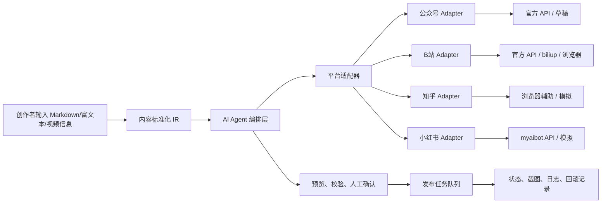

# 系统架构设计

## 总体思路

项目采用“内容中台 + 平台适配器 + AI Agent 发布助理”。

## 核心边界

- `models/` 定义统一内容 IR、平台草稿、校验问题和发布结果。
- `adapters/` 只负责平台规则、渲染、校验、模拟和发布动作。
- `agents/` 负责多 Agent 编排，不直接耦合平台实现。
- `services/` 负责业务用例编排，例如生成预览、创建发布任务、汇总校验报告。
- `tasks/` 负责异步执行和重试策略，正式发布不依赖 FastAPI `BackgroundTasks`。
- `automation/` 负责 Playwright 浏览器辅助发布和截图采集。

## 当前阶段范围

第一阶段已经形成模拟闭环：

1. 接收用户输入内容。
2. 标准化为内容 IR。
3. 生成四个平台的草稿预览。
4. 运行格式和合规校验。
5. 创建模拟发布任务。
6. 返回预览、校验报告、任务状态和截图占位记录。

第二阶段开始接入真实发布：

- 账号凭据加密保存，公众号使用 AppID/AppSecret，B站使用 passport 登录后获取的 Cookie 凭据。
- 发布素材先上传到后端本地存储，再由平台 Adapter 上传到目标平台。
- 真实发布任务交给 Celery worker 执行，FastAPI 只负责创建任务和查询状态。
- `publication_records` 保存平台外部 ID、外部状态、响应快照和错误信息。

当前平台状态：

| 平台 | 预览 | 模拟发布 | 真实发布状态 |
|------|------|----------|--------------|
| 公众号 | 已支持 | 已支持 | 已接入素材上传、草稿创建、草稿发布和状态查询 |
| B站 | 已支持 | 已支持 | 已接入视频/封面上传、稿件提交、状态查询和测试稿件删除 |
| 小红书 | 已支持 | 已支持 | 已实现 myaibot API Adapter 和字段映射；账号入口与真实联调仍需补齐 |
| 知乎 | 已支持 | 已支持 | 暂不进入真实发布 API |

## 前端工作台数据流

前端以 `App.vue` 为状态枢纽，主要数据流如下：

1. `EditorView` 维护标题、正文、标签、目标平台和 Agent 优化选项。
2. `MediaLibraryPanel` 维护共享素材库，素材数据通过 IndexedDB 和 localStorage 保存。
3. `buildContentPayload()` 汇总编辑区和素材引用，传给普通预览或 Agent 预览。
4. `PreviewView` 只读取 `preview.drafts.<platform>`，按平台分别渲染标题、摘要、章节标题、正文和素材。
5. `PublishConfirmView` 在统一配置和分平台配置之间切换，生成用户确认后的发布字段。
6. `buildPublishTaskPayload()` 合并 `platform_options`、`asset_ids`、`content_blocks` 和 `inline_drafts`，提交给 `/api/v1/publish-tasks`。

更细的字段来源见 [发布字段映射](./publish-field-mapping.md)。
