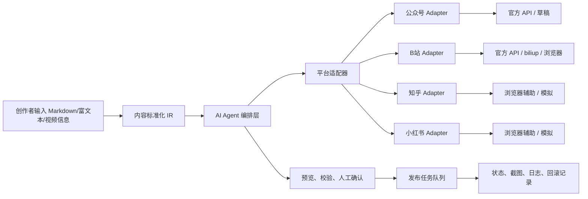

# 系统架构设计

## 总体思路

项目采用“内容中台 + 平台适配器 + AI Agent 发布助理”。

## 核心边界

- `models/` 定义统一内容 IR、平台草稿、校验问题和发布结果。
- `adapters/` 只负责平台规则、渲染、校验、模拟和发布动作。
- `agents/` 负责多 Agent 编排，不直接耦合平台实现。
- `services/` 负责业务用例编排，例如生成预览、创建发布任务、汇总校验报告。
- `tasks/` 负责异步执行和重试策略，正式发布不依赖 FastAPI `BackgroundTasks`。
- `automation/` 负责 Playwright 浏览器辅助发布和截图采集。

## 第一阶段范围

第一阶段只实现模拟闭环：

1. 接收用户输入内容。
2. 标准化为内容 IR。
3. 生成四个平台的草稿预览。
4. 运行格式和合规校验。
5. 创建模拟发布任务。
6. 返回预览、校验报告、任务状态和截图占位记录。

真实发布、账号授权、浏览器自动填充和数据反馈在后续阶段补齐。
