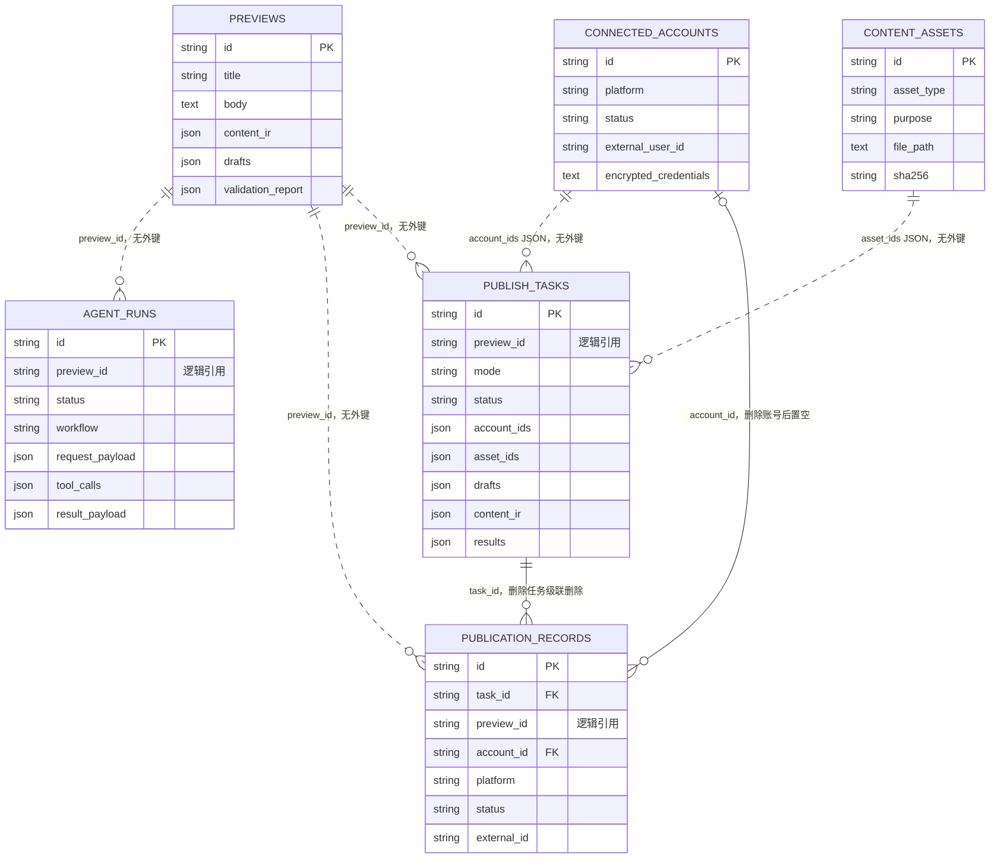

# 数据库模型说明

> 本文描述 Auto_Upt 当前 PostgreSQL 业务表、真实外键关系、逻辑引用和迁移策略。字段以当前 SQLAlchemy 模型和 Alembic 迁移为准。

## 1. 模型总览

当前数据库包含六张核心业务表：



实线表示数据库外键，虚线表示仅通过 ID 或 JSON 保存的逻辑引用。

## 2. 表职责

### 2.1 `previews`

保存可持久化的平台预览：

| 字段 | 说明 |
|---|---|
| `raw_input` | 原始内容请求快照 |
| `content_ir` | 标准化内容 IR |
| `drafts` | 各平台草稿 |
| `validation_report` | 平台校验结果 |

当前普通预览接口可以内存方式返回结果，并非每次预览都会写入该表。发布任务不能假定对应预览记录始终存在。

### 2.2 `agent_runs`

保存工具驱动 Agent 运行记录：

| 字段 | 说明 |
|---|---|
| `workflow` | 工作流名称，当前默认 `adapt_preview` |
| `platforms` | 目标平台列表 |
| `request_payload` | Agent 输入快照 |
| `tool_calls` | 工具执行记录 |
| `result_payload` | Agent 最终结果 |
| `preview_id` | 生成预览的逻辑 ID，无外键 |

规则模拟 Agent 链路不一定写入该表，具体边界见 [Agent 工作流](./agent-workflow.md)。

### 2.3 `connected_accounts`

保存平台账号连接记录：

| 字段 | 说明 |
|---|---|
| `platform` | 平台标识 |
| `display_name` | 页面展示名称 |
| `status` | 连接状态 |
| `auth_type` | 鉴权类型 |
| `external_user_id` | 平台账号 ID，例如公众号 AppID |
| `encrypted_credentials` | 加密后的平台凭据 |
| `credential_metadata` | 非敏感凭据元信息 |
| `token_expires_at` | 可选过期时间 |

明文凭据不应进入普通 API 响应。`CREDENTIAL_ENCRYPTION_KEY` 用于加解密，不能随意更换。

### 2.4 `content_assets`

保存后端发布素材元信息，实际文件位于 `file_path`：

| 字段 | 说明 |
|---|---|
| `asset_type` | `image`、`video` 或 `file` |
| `purpose` | `cover`、`body_image`、`video` 等用途 |
| `original_filename` | 用户上传时的文件名 |
| `filename` | 后端随机生成的存储文件名 |
| `file_path` | 后端磁盘路径 |
| `file_size` | 文件大小 |
| `sha256` | 文件摘要，当前用于记录和索引 |
| `asset_metadata` | 扩展元信息 |

数据库只保存元信息，不保存文件二进制。详细生命周期见 [数据与素材存储设计](./storage-and-data.md)。

### 2.5 `publish_tasks`

保存模拟、草稿或真实发布任务：

| 字段 | 说明 |
|---|---|
| `preview_id` | 来源预览逻辑 ID，无外键 |
| `mode` | `simulate`、`draft` 或 `publish` |
| `status` | `pending`、`running`、`succeeded` 或 `failed` |
| `platforms` | 目标平台列表 |
| `account_ids` | 平台到账号 ID 的 JSON 映射 |
| `asset_ids` | 平台到素材 ID 列表的 JSON 映射 |
| `platform_options` | 用户确认后的平台字段 |
| `drafts` | 平台草稿快照 |
| `content_ir` | 内容 IR 快照 |
| `results` | 各平台执行结果 |
| `error_message` | 任务级错误 |

`drafts` 和 `content_ir` 使异步发布任务不依赖可变或可能不存在的预览记录。

### 2.6 `publication_records`

保存发布任务中每个平台的一次执行结果：

| 字段 | 说明 |
|---|---|
| `task_id` | 所属发布任务，真实外键 |
| `preview_id` | 来源预览逻辑 ID，无外键 |
| `account_id` | 使用的账号，真实外键且可为空 |
| `platform`, `mode`, `status` | 平台执行上下文 |
| `external_id`, `external_url`, `external_status` | 外部平台返回的信息 |
| `request_payload`, `response_payload` | 请求和响应快照 |
| `error_message` | 平台级错误 |

删除 `publish_tasks` 记录会级联删除对应发布记录。删除账号记录时，历史发布记录的 `account_id` 会被置空，历史结果仍保留。

## 3. 逻辑引用与快照

以下引用不是数据库外键：

| 来源 | 字段 | 目标 | 原因与影响 |
|---|---|---|---|
| `publish_tasks` | `preview_id` | `previews.id` | 发布任务保存独立快照，不因预览删除而丢失 |
| `publication_records` | `preview_id` | `previews.id` | 保留来源标识，但发布记录生命周期独立 |
| `agent_runs` | `preview_id` | `previews.id` | Agent 运行记录可独立保存 |
| `publish_tasks` | `account_ids` | `connected_accounts.id` | 多平台账号映射保存在 JSON 中 |
| `publish_tasks` | `asset_ids` | `content_assets.id` | 多平台素材映射保存在 JSON 中 |

逻辑引用提高了快照独立性，但数据库不会自动阻止删除仍被任务引用的账号或素材。相关删除操作需要由业务服务检查。

## 4. 索引

当前主要索引：

- `connected_accounts.platform`
- `content_assets.asset_type`
- `content_assets.sha256`
- `publish_tasks.preview_id`
- `publication_records.task_id`
- `publication_records.preview_id`
- `publication_records.account_id`
- `publication_records.platform`
- `agent_runs.preview_id`

任务列表当前主要按 `created_at` 倒序查询，但该字段尚无专用索引。数据量增大后可根据实际查询计划增加复合索引，例如状态、平台和创建时间组合。

## 5. 数据库初始化与迁移

数据库结构由两套机制共同保障：

1. **Alembic 迁移**：`migrations/versions/` 保存可追踪的结构变更。
2. **应用启动兼容检查**：`init_db()` 调用 `Base.metadata.create_all()`，并通过 `_ensure_publish_schema()` 补充部分发布字段和移除旧预览外键。

当前迁移顺序：

```text
20260530_0001
  -> 20260531_0002
  -> 0c231f9ebaea
  -> 20260531_0003
```

关键变化：

- 初始创建预览、账号、素材、发布任务和发布记录；
- 新增 Agent 运行记录；
- 为发布任务增加 `drafts` 和 `content_ir` 快照；
- 移除发布任务和发布记录对预览表的外键。

正式结构变更应新增 Alembic migration，并同步更新 SQLAlchemy 模型。启动兼容检查只用于已有环境兼容，不能替代完整迁移历史。

执行迁移：

```powershell
alembic upgrade head
```

## 6. 删除规则

| 删除对象 | 数据库行为 | 文件行为 |
|---|---|---|
| 发布任务 | 对应 `publication_records` 级联删除 | 不删除素材文件 |
| 连接账号 | 历史发布记录 `account_id` 置空 | 无 |
| 预览 | 不影响发布任务、发布记录和 Agent 运行记录 | 无 |
| 后端素材 | 删除 `content_assets` 记录 | `AssetService` 同时删除 `file_path` 文件 |

发布任务和发布记录目前没有公开的通用删除流程。不要直接清理数据库记录，除非同步确认逻辑引用、外部平台状态和素材保留策略。

## 7. 备份与安全

- PostgreSQL 是业务状态的事实来源，Redis 不是。
- 数据库备份必须与 `storage/assets` 一起考虑。
- `encrypted_credentials` 虽已加密，数据库备份仍应按敏感数据处理。
- 备份和恢复必须保留原 `CREDENTIAL_ENCRYPTION_KEY`。
- `request_payload`、`response_payload` 和 Agent 运行快照可能包含用户内容，导出或分享前需要检查。

## 8. 当前限制与改进方向

- JSON 字段便于保存多平台快照，但缺少字段级约束和外键完整性。
- 账号和素材的逻辑引用删除保护尚不完整。
- `created_at`、任务状态和平台组合缺少面向大数据量的查询索引。
- 启动兼容检查与 Alembic 同时存在，后续应逐步收敛到明确迁移流程。
- 当前没有统一的数据保留周期、归档和清理策略。

> 相关文档：[数据与素材存储设计](./storage-and-data.md) · [系统架构](./architecture.md) · [API 契约](./api-contract.md) · [发布确认流程](./publish-flow.md)

