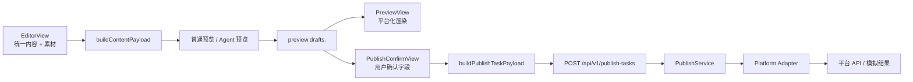

# 项目演示方案

## 演示目标

本次演示重点展示 Auto_Upt 如何帮助创作者完成“统一创作、多平台适配、人工确认、任务发布”的完整流程。

演示要让观众理解三件事：

- 用户只需要维护一份统一内容，系统会生成公众号、B站、知乎、小红书的差异化预览。
- Agent 可以参与标题、正文、标签和平台风格优化，但不会绕过用户确认直接发布。
- 发布前会进入确认页，最终提交字段来自用户确认、Agent 草稿和素材库的合并结果。

## 演示对象

- 产品评审：关注工作流是否顺、功能边界是否清楚。
- 开发评审：关注前后端字段流、平台 Adapter、发布任务和扩展方式。
- 运营/内容使用者：关注编辑体验、素材管理、平台预览和发布确认是否好理解。

## 演示前准备

### 环境准备

建议准备两个演示环境：

| 环境 | 用途 | 说明 |
|------|------|------|
| 本地开发环境 | 功能演示和调试 | 便于查看控制台、接口请求和本地数据 |
| 录屏/备用环境 | 兜底 | 防止现场网络、平台账号或依赖服务异常 |

本地服务建议启动：

```powershell
# 方式一：使用便捷脚本
.\scripts\start-containers.ps1    # 启动 PostgreSQL + Redis
.\scripts\start-backend.ps1       # 启动 FastAPI（后台运行）
.\scripts\start-worker.ps1        # 启动 Celery worker（后台运行）

# 方式二：手动命令
docker compose up -d postgres redis
uvicorn backend.app.main:app --reload
cd frontend && npm run dev
```

如需演示真实发布任务，还需要：

- PostgreSQL、Redis 可用（`docker compose up -d`）。
- Celery worker 已启动。
- `.env` 中配置 `OPENAI_API_KEY`、公众号 AppID/AppSecret、B站账号、小红书 myaibot API Key。
- 前端账号管理中至少连接公众号或 B站账号。

### 演示素材准备

准备一份内容样稿：

- 标题：一条适合多平台发布的主题，例如“AI 内容运营助手如何减少重复发布工作”。
- 正文：包含 3-5 个小节，每节 1-2 段文字。
- 标签：`AI, 内容运营, 自动化, 多平台发布`。
- 图片：1 张封面图，2-3 张正文图。
- 视频：1 个短视频，用于 B站预览。
- 音频：可选，用于展示平台限制提示。

正文中建议包含 Markdown 小标题，例如：

```markdown
## 为什么需要多平台适配

## Auto_Upt 的工作流

## 发布前为什么需要人工确认
```

这样可以清楚展示各平台预览里的章节标题渲染。

## 演示主线

### 1. 进入工作台

讲解重点：

- 左侧是工作台主导航。
- 内容预览、发布确认、任务看板、素材库、账号管理是完整工作流。
- 先从内容编辑区开始，而不是直接进入某个平台后台。

建议话术：

> Auto_Upt 的核心不是替代创作者，而是把重复的平台适配和发布准备工作收拢到一个工作台里。

### 2. 编辑统一内容

操作步骤：

1. 输入标题。
2. 粘贴正文。
3. 填写标签。
4. 选择目标平台：公众号、B站、知乎、小红书。
5. 展示字数统计只统计正文。

讲解重点：

- 统一内容是源头。
- 标题、正文、标签会进入普通预览和 Agent 输入。
- 正文中的章节标题会在平台预览中被识别并渲染。

### 3. 管理素材库

操作步骤：

1. 打开素材库主页面。
2. 创建图片、视频、音频文件夹。
3. 上传封面图、正文图、视频。
4. 展示多级文件夹和返回上级目录。
5. 回到编辑页，展开右侧素材库面板。
6. 将素材插入正文，展示正文引用路径。

讲解重点：

- 素材库主页面和编辑页右侧素材库是同一份数据。
- 正文中展示用户可读路径，而不是内部 ID。
- 重命名、移动、删除素材时，正文引用会同步变化。
- 添加同名文件时应提示覆盖，避免自动改名造成定位困难。

### 4. 生成普通预览

操作步骤：

1. 点击生成预览。
2. 打开预览弹窗。
3. 切换公众号、B站、知乎、小红书。

讲解重点：

- 预览输入来自 `preview.drafts.<platform>`。
- 公众号以手机文章窗格展示标题、摘要、正文和章节。
- B站展示视频/封面、标题、简介、标签和内容要点。
- 知乎展示回答/文章风格的标题、摘要、章节、正文和图片。
- 小红书展示手机窗格、图片轮播、标题、正文、话题。
- 不支持的平台能力会以提示方式展示，例如音视频限制。

### 5. 使用 Agent 优化

操作步骤：

1. 选择 Agent 优化选项。
2. 保持“是否允许修改标题/标签”开关的差异。
3. 点击智能优化。
4. 展示 Agent 输出：标题建议、摘要、优化正文、各平台草稿。
5. 使用某个平台预览发布。

讲解重点：

- Agent 输入来自统一编辑区和素材信息。
- Agent 输出包含 `metadata`、`rewritten_content`、`drafts`、`validation_report`。
- 各平台预览使用 Agent 对应平台的 draft，而不是所有平台共用同一份正文。
- Agent 不会自动发布，必须进入发布确认。

### 6. 发布确认

操作步骤：

1. 进入发布确认页。
2. 展示统一配置模式：全局标题、全局摘要/简介同步到各平台。
3. 切到独立配置模式：各平台字段从 Agent draft 初始化。
4. 修改公众号作者、评论设置。
5. 修改 B站标签、分类。
6. 修改小红书标题和正文。
7. 选择模拟、保存草稿或真实发布。

讲解重点：

- 发布确认页是用户最终控制点。
- 统一配置适合快速发布，独立配置适合精修平台内容。
- 最终提交的 `platform_options` 来自用户确认后的字段。
- `asset_ids` 来自素材库中被选中的封面、图片、视频。

### 7. 创建发布任务

操作步骤：

1. 先演示 `simulate` 模式，确保无外部平台风险。
2. 进入任务看板查看任务状态。
3. 展示每个平台的结果、提示和可执行操作。
4. 如环境允许，再演示公众号草稿或 B站稿件提交。

讲解重点：

- 任务会保存草稿快照，不依赖用户停留在当前页面。
- 真实发布由 Celery worker 异步执行。
- 发布记录会保存平台外部 ID、状态、响应和错误信息。
- 知乎当前只做预览和模拟。
- 小红书后端 Adapter 已接入 myaibot API，但账号入口和真实联调需要作为后续补齐项说明。

## 技术讲解路线

如果面向开发评审，可以在功能演示后补一段技术结构：



讲解重点：

- `PreviewView` 不直接读编辑器正文，只读平台 draft。
- `PublishConfirmView` 输出用户确认后的发布字段。
- `PublishService` 把 `draft`、`platform_options`、`asset_ids` 合并给 Adapter。
- 新平台只需要补 Adapter、renderer、profile 和必要的账号/素材逻辑。

## 演示检查清单

演示前检查：

- 前端能正常启动并访问。
- 后端接口健康。
- 数据库和 Redis 已启动。
- 素材上传可用。
- 普通预览可生成。
- Agent 预览在无 `OPENAI_API_KEY` 时能回退规则引擎。
- 任务看板能刷新。
- 账号管理中公众号或 B站连接状态明确。

演示中避免：

- 不要直接演示真实发布到公开平台，除非账号和内容已经准备好。
- 不要临场上传过大的视频文件。
- 不要依赖外网图片链接作为唯一素材来源。
- 不要承诺知乎真实发布能力。

## 风险与兜底

| 风险 | 表现 | 兜底方式 |
|------|------|----------|
| LLM 不可用 | Agent 优化失败或回退 | 说明系统支持规则引擎回退，继续演示普通预览 |
| 平台账号异常 | 真实发布失败 | 改演示模拟发布和任务错误提示 |
| 视频上传慢 | B站发布等待过久 | 使用小文件或只展示 B站预览 |
| 外部 API 不稳定 | 小红书提交失败 | 说明 Adapter 已接入，演示字段映射和任务结构 |
| 素材过大 | 页面卡顿或上传失败 | 使用压缩后的演示素材 |

## 建议演示时长

| 环节 | 时长 |
|------|------|
| 项目背景与目标 | 2 分钟 |
| 内容编辑与素材库 | 5 分钟 |
| 多平台预览 | 5 分钟 |
| Agent 优化 | 4 分钟 |
| 发布确认与任务看板 | 5 分钟 |
| 技术架构说明 | 4 分钟 |
| Q&A | 5 分钟 |

总时长建议控制在 25-30 分钟。

## 演示结论

Auto_Upt 当前适合展示为一个“多平台内容发布准备工作台”：

- 前端已经形成完整工作流。
- 后端已经具备预览、模拟、部分真实发布和 Agent 编排基础。
- 平台扩展边界清楚，后续可以继续补齐知乎/小红书账号和发布联调。
- 当前阶段应强调“发布前人工确认”，避免给人完全自动发布且无人工把关的误解。
