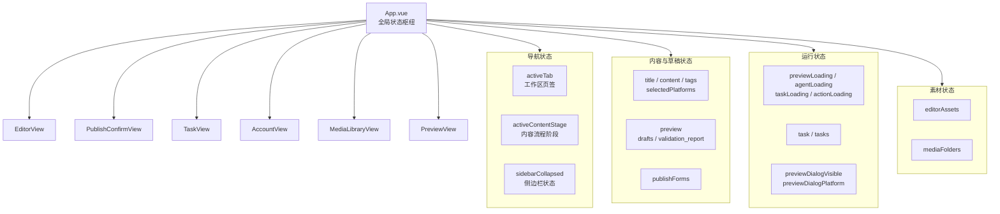
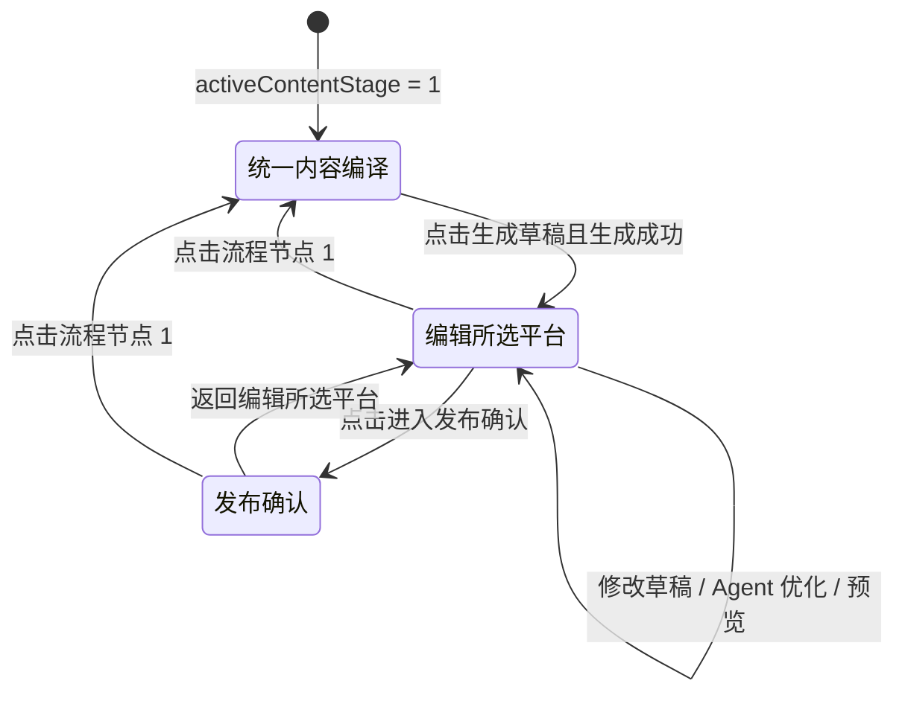
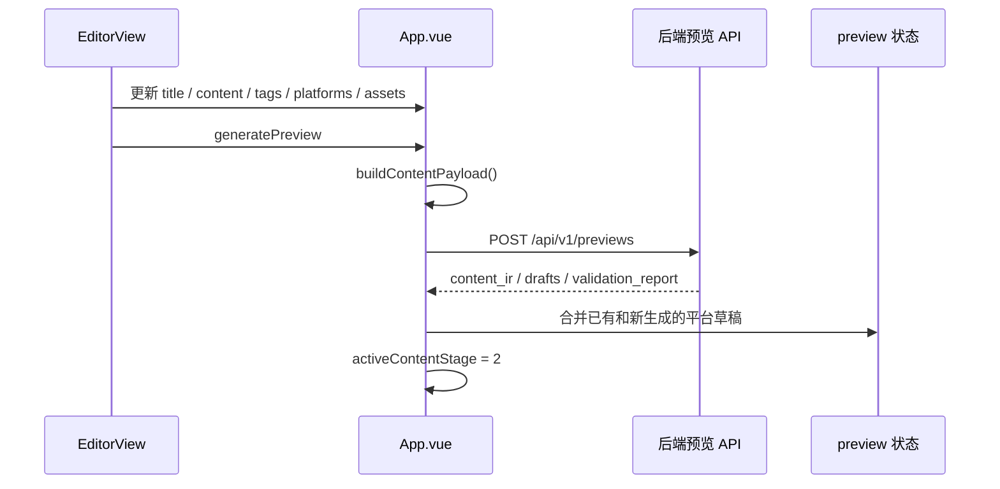
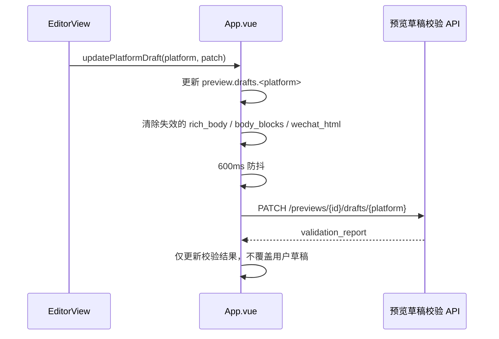
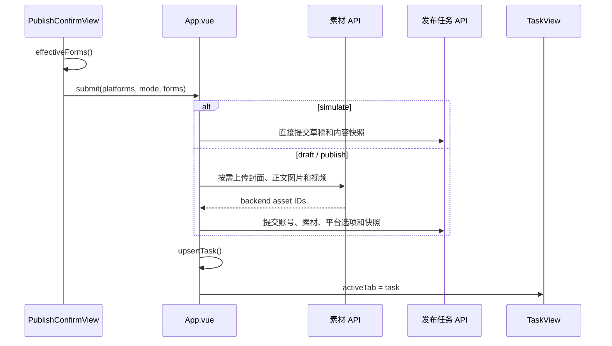
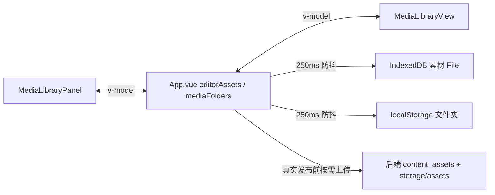

# 前端状态流

> 本文描述 Auto_Upt 前端当前的状态所有权、页面切换、三阶段内容流程、素材持久化以及与后端 API 的同步边界。

## 1. 当前状态架构

前端采用 Vue 3 + TypeScript + Element Plus，当前没有使用 `vue-router` 或 Pinia。`App.vue` 是全局状态枢纽，通过 props、`v-model` 和组件事件连接各视图。



## 2. 工作区导航

`activeTab` 控制左侧导航对应的四个工作区：

| `activeTab` | 页面 | 主要状态 |
|---|---|---|
| `preview` | 内容工作台 | 编辑内容、平台草稿、发布确认 |
| `task` | 任务看板 | 发布任务和平台结果 |
| `media` | 独立多媒体库 | 与编辑区共享的素材和文件夹 |
| `account` | 账号管理 | 平台账号配置与连接状态 |

当前页签切换由 `selectTab()` 直接更新 `activeTab`，没有 URL 路由。刷新浏览器后，页签会回到默认的内容工作台，但任务列表和浏览器素材会重新加载。

## 3. 内容工作流状态

内容工作台内部由 `activeContentStage` 管理三个阶段：



关键规则：

- `availableContentStage` 由 `hasGeneratedDraft` 决定。
- 没有任何有效平台草稿时，只允许进入阶段 1。
- 生成草稿成功后自动进入阶段 2，并允许进入阶段 3。
- “进入发布确认”按钮可以进入阶段 3；当前代码在已有草稿时，也允许点击顶部阶段 3 节点进入。
- 当前阶段之前的节点可以通过顶部流程节点回退。
- 清空所有平台草稿后，`preview` 会被置空，后续阶段重新变为不可用。

## 4. 统一内容到平台草稿



`buildContentPayload()` 汇总：

- 标题、正文和标签；
- 所选平台；
- 正文引用的素材；
- `content_blocks`；
- 当前封面素材 ID。

重新生成草稿时，如果所选平台已经存在草稿，前端会先要求用户确认。新响应会与其他未重新生成平台的已有草稿合并。

## 5. 平台草稿编辑与同步

平台草稿保存在 `preview.drafts.<platform>`。`EditorView` 不直接持有独立草稿副本，而是通过事件请求 `App.vue` 更新。



手动修改正文后，旧的结构化渲染结果会被清空，避免正文与富文本块不一致。后端同步响应只用于更新校验报告，不重新覆盖用户正在编辑的草稿。

## 6. Agent 优化状态流

单平台优化和批量优化都由 `App.vue` 调用 Agent 接口并重新生成平台预览：

```text
EditorView 发出优化事件
  -> App.vue 构建内容与优化选项
  -> POST /agent-runs/adapt-preview
  -> POST /previews
  -> 合并目标平台草稿与校验结果
```

- `agentLoading` 控制优化期间的按钮状态。
- 标题和标签是否应用由优化选项决定。
- 正文素材标记会在 Agent 改写后重新补回，避免素材引用丢失。
- 批量优化按所选平台逐个平台执行，并将结果合并到同一个 `preview`。

## 7. 发布确认状态流

`PublishConfirmView` 使用双向绑定的 `publishForms`，并在组件内部维护：

- 发布确认所选平台；
- `selectedMode`；
- 统一或独立配置模式；
- 当前账号列表和连接状态。



规则边界：

- 未连接平台可选择，但发布模式会保持或恢复为 `simulate`。
- `draft` 和 `publish` 会显示二次确认。
- 真实任务提交前才会把浏览器素材按需上传到后端。
- 提交失败时会创建本地失败任务，并跳转任务看板展示原因。

## 8. 任务看板状态

| 状态 | 来源 | 更新方式 |
|---|---|---|
| `tasks` | `GET /publish-tasks?limit=20` | 页面挂载、刷新列表、草稿转发布后重载 |
| `task` | 当前最新或最近操作任务 | `upsertTask()` 或任务列表加载 |
| `taskHistoryLoading` | 任务列表请求 | 请求开始/结束 |
| `taskActionLoading` | 刷新状态或草稿发布操作 | 使用操作类型与 ID 标识 |
| `taskErrorMessage` | 任务请求错误 | 操作失败时更新 |

页面挂载时会异步加载任务列表。任务看板数据来自后端 PostgreSQL，因此浏览器刷新后可以恢复。

## 9. 素材状态与持久化

`editorAssets` 和 `mediaFolders` 同时供编辑区素材面板和独立多媒体库使用。



素材读取和保存边界见 [数据与素材存储设计](./storage-and-data.md)。

## 10. 状态所有权约定

| 状态类型 | 推荐所有者 |
|---|---|
| 跨工作区共享、影响流程节点或 API 请求 | `App.vue` |
| 单一视图内部的临时 UI 状态 | 对应 View |
| 父子组件共享的可编辑值 | `defineModel` / `v-model` |
| 子组件触发的业务动作 | `defineEmits`，由 `App.vue` 执行 |
| 可从其他状态推导的值 | `computed` |
| 浏览器素材持久化 | `useIndexedDB` 与 localStorage |
| 可恢复的业务事实 | 后端 API 与 PostgreSQL |

新增状态前应先判断它是否需要跨工作区共享或刷新恢复。不要把可持久化业务事实仅保存在组件局部状态中。

## 11. 当前限制与改进方向

- `App.vue` 同时承担导航、内容、素材、发布和任务状态，复杂度持续增加。
- 没有 URL 路由，无法通过链接直接进入任务、账号或指定流程阶段。
- 当前没有统一的脏数据版本号；阶段可用性主要由是否存在草稿判断。
- 当前顶部流程节点在已有草稿时允许直接进入发布确认，与“发布确认只能通过进入发布确认按钮跳转”的产品规则存在差异。
- 发布确认账号状态在组件挂载时加载，跨页面更新依赖重新加载或组件事件。
- 后续可将内容工作流、素材库和任务看板分别抽为 composable 或 Pinia store，再引入 Router 管理工作区导航。

> 相关文档：[系统架构](./architecture.md) · [生成预览流程](./preview-flow.md) · [发布确认流程](./publish-flow.md) · [数据与素材存储设计](./storage-and-data.md)
