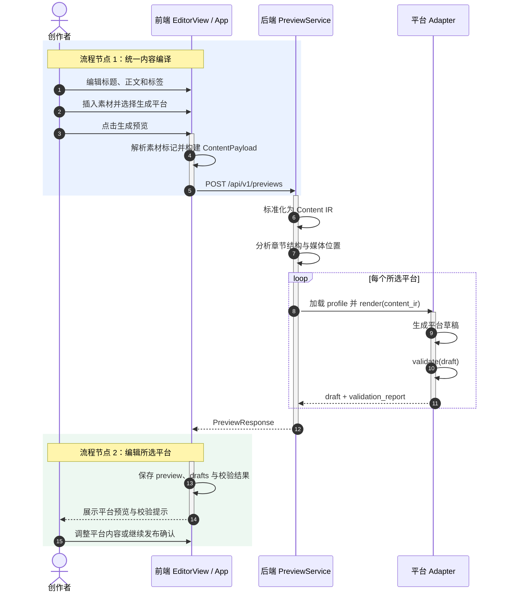

# 生成预览 —— 业务流程图

> 描述从用户输入内容到多平台预览展示的前后端通讯过程。

---

---

## 步骤详解

### Step 1：前端构建请求

创作者填写标题/正文/标签，选择目标平台，上传素材后点击「生成预览」。前端汇总为 `ContentPayload` 发送 `POST /api/v1/previews`。

### Step 2：后端内容标准化

后端将用户输入标准化为**内容 IR**（统一中间表示）：
- 标题为空时，LLM 从正文推断（LLM 不可用时回退到正文首行）
- 标签为空时，LLM 提取关键词（规则兜底）
- 分析章节结构、媒体素材位置、字数统计

### Step 3：逐平台渲染草稿

对每个选中平台，调用 `Adapter.render(content_ir)` 将内容 IR 转为平台草稿：

| 平台 | 渲染输出 |
|------|---------|
| 公众号 | 富文本 HTML + 结构化渲染块 + 封面/素材槽位 |
| B站 | 视频标题 + 简介 + 标签 + 分区 |
| 知乎 | 文章块格式（结论/标题/引用/图片） |
| 小红书 | 笔记标题 + 正文 + 话题标签 + 图片槽位 |

然后执行 `Adapter.validate(draft)` 校验格式，返回错误/警告/提示。

### Step 4：返回前端展示

后端返回 `PreviewResponse`（含 `preview_id`、`drafts`、`validation_report`），前端按平台 Tab 渲染预览组件——公众号手机窗格、B站播放器样式、知乎文章样式、小红书笔记窗格。

---

## 关键设计决策

| 决策 | 原因 |
|------|------|
| 预览不落库 | 临时计算产物，避免数据一致性问题 |
| LLM 增强 + 规则回退 | 无 API Key 时预览仍可用 |
| 平台 Adapter 解耦 | 新增平台只需加 adapter + profile.yaml |
| 统一 IR 中转 | 各平台 Adapter 基于同一份标准化内容渲染 |

---

> **相关文档**：[架构设计](./architecture.md) · [API 契约](./api-contract.md) · [发布确认流程图](./publish-flow.md) · [账号登录流程图](./account-flow.md)
