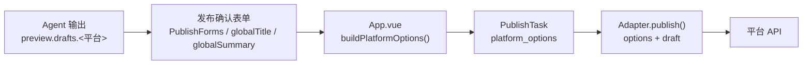

# 发布确认 — 字段来源与 API 映射

> 本文档描述从 Agent 预览输出 → 发布确认表单 → 前端提交合并 → 后端平台 Adapter → 平台 API 的完整数据链路。

---

## 1. 整体数据流



- **Agent 输出**：预览阶段生成的平台草稿，作为各字段的**兜底回退值**。
- **发布确认表单**：用户在统一配置或独立 Tab 中手写/修改的字段，作为**第一优先级**。
- **`buildPlatformOptions()`**：合并表单值、Agent 输出、全局标题/正文，生成最终 `platform_options`。
- **`Adapter.publish()`**：消费 `options`（来自 `platform_options`）和 `draft`（来自 Agent），拼装 API 请求。

---

## 2. Agent 输出结构

Agent 为每个平台生成 `drafts.<platform>` 对象，字段如下：

| 平台 | 字段 | 类型 | 说明 |
|------|------|------|------|
| **公众号** | `title` | `string` | 文章标题 |
| | `summary` | `string` | 文章摘要 |
| | `body` | `string` | HTML 正文 |
| | `wechat_html` | `string` | 公众号专用格式化 HTML |
| **B站** | `title` | `string` | 视频标题 |
| | `body` | `string` | 视频简介/描述 |
| | `tags` | `string[]` | 标签列表 |
| **小红书** | `title` | `string` | 笔记标题 |
| | `body` | `string` | 笔记正文（纯文本） |
| **知乎** | — | — | 仅模拟预览，无草稿/发布 |

---

## 3. 发布确认表单

### 3.1 统一配置模式 (`PublishConfirmView`)

独立全局字段，写入时**同步至所有选定平台**：

| 全局字段 | 同步至 |
|---------|--------|
| `globalTitle` | `wechat.title`、`bilibili.title`、`xiaohongshu.title` |
| `globalSummary` | `wechat.summary`、`bilibili.description`、`xiaohongshu.content` |

平台唯一字段（仅勾选对应平台时显示）：

| 平台 | 表单字段 | 对应变量 |
|------|---------|----------|
| 公众号 | 作者 | `wechat.author` |
| | 原文链接 | `wechat.contentSourceUrl` |
| | 开启评论 | `wechat.needOpenComment` |
| | 仅粉丝可评论 | `wechat.onlyFansCanComment` |
| B站 | 标签（逗号分隔） | `bilibili.tags` |
| | 分类 | `bilibili.category` |
| 小红书 | — | 无额外字段，title/content 由全局同步 |

### 3.2 独立配置模式 (`PublishFormView`)

每个平台有独立 Tab，直接编辑 `publishForms.<platform>.*`：

| 平台 | Tab 字段 | 限制 |
|------|---------|------|
| 公众号 | 标题、摘要、作者、原文链接、评论设置、发布方式 | title≤64字, summary≤120字 |
| B站 | 仅显示封面/视频素材状态 | — |
| 小红书 | 标题、正文 | title≤20字符, content≤1000字符 |
| 知乎 | 无表单（仅模拟） | — |

---

## 4. 前端提交合并 (`App.vue` → `buildPlatformOptions`)

当字段为空时，按以下优先级回退：**表单值 → Agent 输出 → 全局/编辑器值**。

### 4.1 公众号

| 最终字段 | 回退链 (优先级从高到低) |
|---------|------------------------|
| `title` | ① `wechat.title` → ② `drafts.wechat.title` → ③ `title` (全局标题) |
| `author` | ① `wechat.author`（无回退） |
| `digest` | ① `wechat.summary` → ② `drafts.wechat.summary` → ③ `""` |
| `content_source_url` | ① `wechat.contentSourceUrl`（无回退） |
| `need_open_comment` | ① `wechat.needOpenComment`（布尔值） |
| `only_fans_can_comment` | ① `needOpenComment && wechat.onlyFansCanComment` |
| `direct_publish` | ① `wechat.directPublish`（与 `selectedMode` 联动） |

### 4.2 B站

| 最终字段 | 回退链 |
|---------|--------|
| `title` | ① `bilibili.title` → ② `drafts.bilibili.title` → ③ `title` (全局标题) |
| `description` | ① `bilibili.description` → ② `drafts.bilibili.body` → ③ `content` (编辑器正文) |
| `tags` | ① `bilibili.tags` 逗号拆分 → ② `drafts.bilibili.tags` → ③ `[]` |
| `tid` | 固定 `201` (科技分类) |
| `copyright` | 固定 `1` (自制) |
| `source` | 固定 `""` |
| `no_reprint` | 固定 `true` |
| `dynamic` | 固定 `""` |

### 4.3 小红书

| 最终字段 | 回退链 |
|---------|--------|
| `title` | ① `xiaohongshu.title` → ② `drafts.xiaohongshu.title` → ③ `title` (全局标题) |
| `content` | ① `xiaohongshu.content` → ② `drafts.xiaohongshu.body` → ③ `""` |

> ⚠️ 小红书不回退到公众号字段。Agent 输出的 `drafts.xiaohongshu` 是唯一的内容来源。

### 4.4 素材映射 (`buildPublishTaskPayload`)

| 平台 | 素材要求 | 对应 `asset_ids` / `platform_options` |
|------|---------|--------------------------------------|
| 公众号 | 封面图 + 正文图片 | `asset_ids.wechat`，`platform_options.wechat.cover_asset_id` |
| B站 | 视频 + 封面图 | `asset_ids.bilibili`，`platform_options.bilibili.video_asset_id`、`cover_asset_id` |
| 小红书 | 封面图 + 图片/视频 | `asset_ids.xiaohongshu`，`platform_options.xiaohongshu.cover_asset_id` |

---

## 5. 后端 Adapter → 平台 API 映射

### 5.1 公众号 → 微信公众平台 API

**API 端点**：
- `POST /cgi-bin/material/add_material` — 上传封面图 (永久素材)
- `POST /cgi-bin/media/uploadimg` — 上传正文图片
- `POST /cgi-bin/draft/add` — 创建草稿
- `POST /cgi-bin/freepublish/submit` — 发布草稿

**Adapter 字段 → API 字段**：

| Adapter 输入 (`options.*`) | 回退 (`draft.*`) | API 字段 (`article.*`) | 说明 |
|---|---|---|---|
| `options.title` | `draft.title` | `title` | 文章标题 |
| `options.author` | — | `author` | 作者名 |
| `options.digest` | `draft.summary` | `digest` | 摘要 (≤120字) |
| (正文图片替换后) | `draft.wechat_html` | `content` | HTML 正文 |
| `options.content_source_url` | — | `content_source_url` | 原文链接 |
| (封面素材 ID) | — | `thumb_media_id` | 封面图 media_id |
| `options.need_open_comment` | — | `need_open_comment` | 0/1 |
| `options.only_fans_can_comment` | — | `only_fans_can_comment` | 0/1 |

### 5.2 B站 → B站投稿 API

**API 端点**：B站会员中心 `POST` 投稿接口（Cookie 鉴权）

**Adapter 字段 → API 字段**：

| Adapter 输入 (`options.*`) | 回退 (`draft.*`) | API 字段 (`payload.*`) | 说明 |
|---|---|---|---|
| `options.title` | `draft.title` | `title` | 视频标题 |
| `options.description` | `draft.body` | `description` | 视频简介 |
| `options.tags` | `draft.tags` | `tags` | 标签列表 |
| (上传后) | — | `video_id` | 视频投稿 ID |
| (上传后) | — | `cover` | 封面信息 |
| `options.tid` | — | `tid` | 分区 ID (默认 201) |
| `options.copyright` | — | `copyright` | 1=自制 2=转载 |
| `options.source` | — | `source` | 转载来源 |
| `options.no_reprint` | — | `no_reprint` | 0/1 禁止转载 |
| `options.dynamic` | — | `dynamic` | 分享动态文案 |

### 5.3 小红书 → myaibot.vip API

**API 端点**：
- `POST /api/rednote/publish-with-upload` — 提交笔记（自动转存图片/视频）
- `POST /api/rednote/{id}/status` — 查询发布状态

**Adapter 字段 → API 字段**：

| Adapter 输入 (`options.*`) | 回退 (`draft.*`) | API 字段 (`payload.*`) | 说明 |
|---|---|---|---|
| `options.title` | `draft.title` | `title` | 笔记标题 (≤20字符) |
| `options.content` | `draft.body` | `content` | 笔记正文 (≤1000字符) |
| (收集图片 URL) | — | `images[]` | 图片链接数组 (图文笔记) |
| (收集视频 URL) | — | `video` | 视频链接 (视频笔记) |
| (收集封面 URL) | — | `cover` | 封面图链接 |
| (自动判定) | — | `type` | `"normal"` (图文) / `"video"` (视频) |
| (配置) | — | `api_key` | myaibot API 密钥 |

> **发布流程**：提交后返回二维码 → 用户扫码在手机端完成发布。状态查询：`uploading → pending → submitted`。

---

## 6. 平台限制速查

| 限制项 | 公众号 | B站 | 小红书 |
|-------|--------|-----|--------|
| 标题最大长度 | 200 字 | 200 字 | **20 字符** (中文×1, 英文/数字×0.5) |
| 正文最大长度 | 无限制 | 无限制 | **1000 字符** |
| 摘要/简介 | 120 字 | — | — |
| 标签数 | 20 | 20 | 20 |
| 封面图 | 必填 | 可选 | **必填** |
| 图片 | 正文内插图 | — | ≤18 张, ≤32MB/张, PNG/JPG/WebP |
| 视频 | — | 必填 | ≤20GB, ≤60min |
| 鉴权方式 | OAuth (app_id+app_secret) | Cookie (SESSDATA+bili_jct) | API Key |
| 发布模式 | simulate / draft / publish | simulate / draft / publish | simulate / draft / publish |
| 知乎 | — | — | **仅 simulate** |

---

## 7. 发布确认页前端字段速查

### 统一配置模式

```
┌─ 全局标题 ─────────────────────────────────────┐
│  → wechat.title, bilibili.title, xiaohongshu.title │
└────────────────────────────────────────────────┘
┌─ 全局摘要/简介 ────────────────────────────────┐
│  → wechat.summary, bilibili.description,        │
│    xiaohongshu.content                          │
└────────────────────────────────────────────────┘
┌─ 发布方式 (任一可发布平台选中时显示) ──────────┐
│  ○ 模拟  ○ 保存草稿  ○ 真实发布                 │
└────────────────────────────────────────────────┘
┌─ 公众号 (勾选时显示) ──────────────────────────┐
│  作者、原文链接、评论设置                        │
└────────────────────────────────────────────────┘
┌─ B站 (勾选时显示) ─────────────────────────────┐
│  标签(逗号分隔)、分类                            │
└────────────────────────────────────────────────┘
```

### 独立配置模式

```
┌─ Tabs ─────────────────────────────────────────┐
│  [公众号] [B站] [小红书] [知乎]                  │
│                                                 │
│  公众号 Tab: 标题、摘要、作者、原文链接、         │
│             评论设置、发布方式                    │
│  B站 Tab: 封面/视频素材状态                      │
│  小红书 Tab: 标题(20字)、正文(1000字)            │
│  知乎 Tab: 仅模拟，无表单                        │
└────────────────────────────────────────────────┘
```
