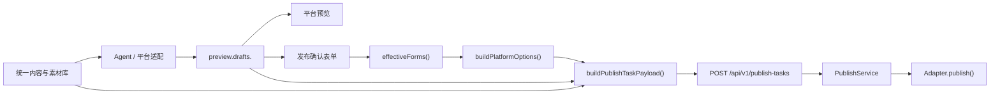

# 发布确认字段映射

> 本文描述当前实现中，从平台草稿、发布确认表单到发布任务和平台 Adapter 的字段流向。

## 1. 当前能力边界

| 平台 | 生成平台草稿 | 模拟发布 | 草稿/真实发布 | 当前限制 |
|---|:---:|:---:|:---:|---|
| 公众号 | 是 | 是 | 是 | 真实任务需要已连接账号和封面；正文图片会在 Adapter 中上传并替换链接 |
| B站 | 是 | 是 | 是 | 真实任务需要已连接账号和视频；封面可选 |
| 知乎 | 是 | 是 | 否 | 仅进入预览与模拟链路 |
| 小红书 | 是 | 是 | Adapter 路径已存在 | 当前账号配置界面尚未接通，正常界面流程无法完成真实任务 |

未连接平台仍可被选择并执行 `simulate`。只有所选平台全部支持真实发布且账号已连接时，才可选择 `draft` 或 `publish`。

## 2. 数据流

- `preview.drafts.<platform>` 是平台预览和发布字段回退值的主要来源。
- 发布确认页先通过 `effectiveForms()` 得到最终表单。统一配置模式会把全局标题、摘要同步到各平台表单；独立配置模式保留各平台字段。
- `buildPlatformOptions(platforms, forms)` 只接收最终表单，不再单独判断统一或独立配置模式。
- `buildPublishTaskPayload()` 合并平台选项、草稿快照、内容 IR、账号 ID 和素材 ID。

## 3. 平台草稿

Agent 为平台生成 `drafts.<platform>`。当前发布链路使用的主要字段如下：

| 平台 | 主要字段 | 用途 |
|---|---|---|
| 公众号 | `title`, `summary`, `body`, `wechat_html`, `rich_body`, `tags` | 预览、摘要回退、公众号 HTML 正文 |
| B站 | `title`, `body`, `tags`, `media_slots` | 视频标题、简介、标签及素材提示 |
| 知乎 | `title`, `summary`, `body`, `rich_body`, `tags` | 预览与模拟 |
| 小红书 | `title`, `summary`, `body`, `tags`, `media_slots` | 笔记标题、正文及素材提示 |

## 4. 发布确认表单

### 4.1 最终表单生成

发布确认页提交前调用 `effectiveForms()`：

- 统一配置：复制当前表单，并将全局标题、摘要写入公众号、B站和小红书对应字段。
- 独立配置：复制各平台表单原值。
- 选择 `publish` 时，公众号表单的 `directPublish` 会被设为 `true`。

平台专属字段：

| 平台 | 表单字段 |
|---|---|
| 公众号 | 标题、摘要、作者、原文链接、评论设置 |
| B站 | 标题、简介、标签、分区 |
| 小红书 | 标题、正文 |
| 知乎 | 当前无真实发布专属字段 |

### 4.2 `platform_options` 映射

#### 公众号

| 最终字段 | 来源与回退 |
|---|---|
| `title` | `forms.wechat.title` → `drafts.wechat.title` → 空字符串 |
| `author` | `forms.wechat.author` |
| `digest` | `forms.wechat.summary` → `drafts.wechat.summary` → `drafts.wechat.body` 前 120 字 → 空字符串 |
| `content_source_url` | `forms.wechat.contentSourceUrl` |
| `need_open_comment` | `forms.wechat.needOpenComment` |
| `only_fans_can_comment` | `needOpenComment && forms.wechat.onlyFansCanComment` |
| `direct_publish` | `forms.wechat.directPublish` |

#### B站

| 最终字段 | 来源与回退 |
|---|---|
| `title` | `forms.bilibili.title` → `drafts.bilibili.title` → 空字符串 |
| `description` | `forms.bilibili.description` → `drafts.bilibili.body` → 空字符串 |
| `tags` | 表单标签拆分结果 → `drafts.bilibili.tags` → 空数组 |
| `tid` | 表单分区转换为数字；无效时使用 `201` |
| `copyright` | 固定为 `1` |
| `source` | 固定为空字符串 |
| `no_reprint` | 固定为 `true` |
| `dynamic` | 固定为空字符串 |

#### 小红书

| 最终字段 | 来源与回退 |
|---|---|
| `title` | `forms.xiaohongshu.title` → `drafts.xiaohongshu.title` → 空字符串 |
| `content` | `forms.xiaohongshu.content` → `drafts.xiaohongshu.body` → 空字符串 |

## 5. 发布任务 Payload

### 5.1 模式差异

| 字段/处理 | `simulate` | `draft` / `publish` |
|---|:---:|:---:|
| `preview_id`, `mode`, `platforms` | 是 | 是 |
| `platform_options` | 是 | 是 |
| `inline_drafts`, `inline_content_ir` | 是 | 是 |
| 已连接账号 ID | 不要求 | 所有真实发布平台均要求 |
| 上传或准备素材 | 不要求 | 按平台要求执行 |
| 执行方式 | API 同步模拟 | 保存快照后进入 Celery 队列 |

发布任务保存内联草稿和内容 IR 快照，因此任务执行不依赖后续仍能读取原预览记录。

### 5.2 素材映射

| 平台 | 真实任务要求 | Payload 映射 |
|---|---|---|
| 公众号 | 封面必需；正文图片按引用准备 | `asset_ids.wechat`, `platform_options.wechat.cover_asset_id` |
| B站 | 视频必需；封面可选 | `asset_ids.bilibili`, `video_asset_id`, `cover_asset_id` |
| 小红书 | 至少需要图片或视频；当前界面流程还受账号配置限制 | `asset_ids.xiaohongshu`, `cover_asset_id` |

## 6. Adapter 到平台字段

### 6.1 公众号

公众号 Adapter 获取访问令牌，上传永久封面和正文图片，替换正文中的本地素材引用，然后创建草稿；`publish` 模式会继续提交发布。

| Adapter 输入 | 回退 | 公众号文章字段 |
|---|---|---|
| `options.title` | `draft.title` | `title` |
| `options.author` | 无 | `author` |
| `options.digest` | `draft.summary` | `digest` |
| 正文图片替换后的 `draft.wechat_html` | `draft.body` | `content` |
| `options.content_source_url` | 无 | `content_source_url` |
| 上传后的封面 `media_id` | 无 | `thumb_media_id` |
| `options.need_open_comment` | 无 | `need_open_comment` |
| `options.only_fans_can_comment` | 无 | `only_fans_can_comment` |

`draft` 返回 `draft_created`；`publish` 创建草稿后提交发布，返回 `submitted`。

### 6.2 B站

B站 Adapter 使用账号 Cookie，上传视频和可选封面，然后提交稿件。

| Adapter 输入 | 回退 | 投稿字段 |
|---|---|---|
| `options.title` | `draft.title` | `title` |
| `options.description` | `draft.body` | `description` |
| `options.tags` | `draft.tags` | `tags` |
| 上传后的视频标识 | 无 | `video_id` |
| 上传后的封面信息 | 无 | `cover` |
| `tid`, `copyright`, `source`, `no_reprint`, `dynamic` | 默认值 | 同名字段 |

当前 B站的 `draft` 与 `publish` 都通过投稿 Adapter 提交；系统没有提供 B站草稿任务再次转发布的接口。

### 6.3 小红书

小红书 Adapter 会把本地素材转换为基于 `PUBLIC_BASE_URL` 的可访问 URL，再调用 myaibot 发布接口。

| Adapter 输入 | 回退 | 笔记字段 |
|---|---|---|
| `options.title` | `draft.title` | `title` |
| `options.content` | `draft.summary` / `draft.body` | `content` |
| 收集后的图片 URL | 无 | `images[]` |
| 收集后的视频 URL | 无 | `video` |
| 封面 URL | 无 | `cover` |

该 Adapter 代码路径可以返回二维码和待处理状态，但当前账号管理与发布确认尚未提供完整的小红书账号配置闭环。

## 7. 任务看板后续操作

- 任务列表和详情通过发布任务 API 主动查询，不由后端直接推送到任务看板。
- 状态刷新主要用于查询外部平台状态。
- 目前只有公众号草稿支持通过 `POST /publications/{id}/publish` 再次提交发布。
- 删除外部发布记录当前仅支持 B站测试投稿场景。

## 8. 已知实现差异

- 后端部分错误提示仍写着真实发布仅支持公众号和 B站，但真实发布平台集合已包含小红书；提示文本与代码能力集合需要后续统一。
- 公众号平台 profile 中封面可选，但当前前端真实任务构建和公众号 Adapter 均要求封面。本文按实际执行行为记录为必需。
