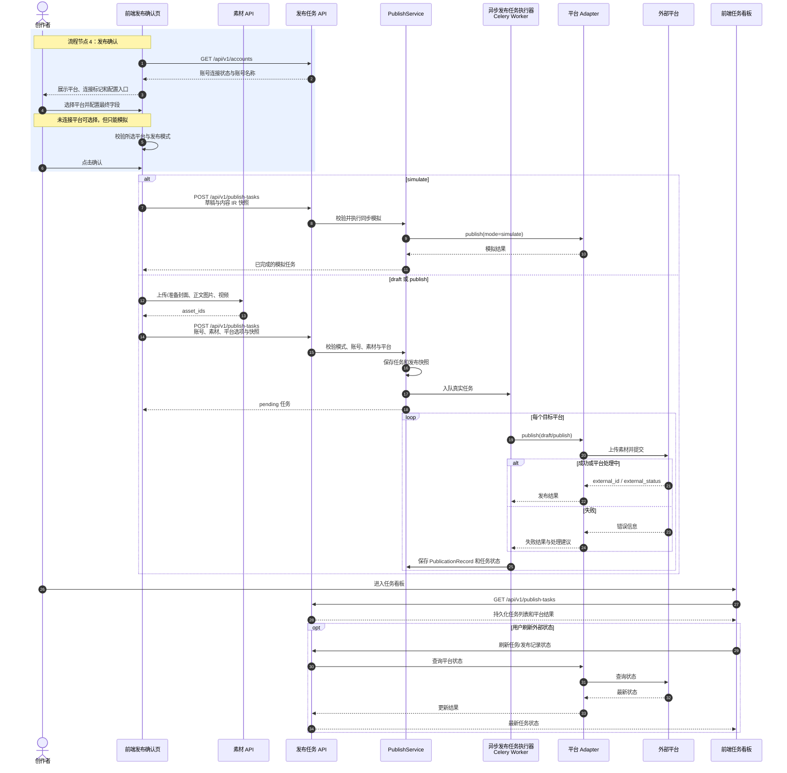

# 发布确认业务流程

> 本文描述当前实现中，从进入发布确认到任务看板跟踪结果的前后端流程。

## 时序图

## 流程说明

### 1. 进入发布确认

用户只能通过“进入发布确认”按钮进入该流程。页面加载账号列表，并展示平台的账号连接标记与账号名称。

- 所有已生成草稿的平台均可被选择并用于模拟。
- 未连接平台被选择后，发布模式只能使用 `simulate`。
- 只有全部所选平台均支持真实发布且账号已连接时，才能选择 `draft` 或 `publish`。
- 取消选择未连接平台不会显示警告。

### 2. 配置发布内容

发布确认支持统一配置和独立配置：

| 方式 | 行为 |
|---|---|
| 统一配置 | 将全局标题、摘要同步到各平台的对应表单字段 |
| 独立配置 | 保留各平台标题、摘要、正文、标签和专属字段 |

最终提交值由 `effectiveForms()` 生成，再由 `buildPlatformOptions()` 转换为平台选项。具体回退顺序见 [发布确认字段映射](./publish-field-mapping.md)。

### 3. 构建并提交任务

前端通过 `buildPublishTaskPayload()` 合并：

- 发布模式与目标平台；
- 平台选项；
- 平台草稿和内容 IR 快照；
- 真实任务所需的账号 ID；
- 真实任务所需的素材 ID。

`simulate` 不要求已连接账号，也不在提交前上传真实平台素材。`draft` 和 `publish` 会先准备素材，再调用 `POST /api/v1/publish-tasks`。

### 4. 后端执行

| 模式 | 执行方式 | 平台调用 |
|---|---|---|
| `simulate` | API 内同步执行 | Adapter 仅生成模拟结果 |
| `draft` | 保存快照后进入 Celery 队列 | 调用支持真实任务的平台 Adapter |
| `publish` | 保存快照后进入 Celery 队列 | 调用支持真实任务的平台 Adapter |

后端在真实任务入队前校验平台、账号和素材。异步发布任务执行器（Celery Worker）按平台调用 Adapter，并为每个平台保存 `PublicationRecord`。

### 5. 各平台真实任务

| 平台 | 当前流程 |
|---|---|
| 公众号 | 获取访问令牌 → 上传封面和正文图片 → 创建草稿 → `publish` 模式继续提交发布 |
| B站 | Cookie 鉴权 → 上传视频 → 可选上传封面 → 提交稿件 |
| 小红书 | Adapter 可整理公开素材 URL 并调用 myaibot；当前账号配置链路未闭环，正常界面流程不可完成真实任务 |
| 知乎 | 不进入真实任务，仅支持预览与模拟 |

### 6. 任务看板

任务看板通过查询 API 展示持久化任务，不依赖发布接口向页面推送状态。刷新页面后仍可重新加载近期任务。

当前后续操作边界：

- 可按任务或发布记录刷新外部状态；
- 只有公众号草稿支持再次提交发布；
- 删除外部发布记录当前仅用于 B站测试投稿场景；
- 平台处理中、成功和失败状态均以 Adapter 保存的外部状态为准。

## 关键设计

| 设计 | 目的 |
|---|---|
| 发布任务保存草稿与内容 IR 快照 | 避免异步执行依赖可变的预览数据 |
| 模拟与真实任务分流 | 未连接账号也能验证完整内容与平台适配结果 |
| 真实任务提交前准备素材 | 确保异步发布任务执行器获得稳定的素材 ID |
| Adapter 封装平台差异 | 核心发布服务不硬编码平台上传和字段规则 |
| Celery 执行真实任务 | 避免视频和图片上传阻塞 API 请求 |

## 已知差异

- 小红书真实发布 Adapter 路径已存在，但账号管理和发布确认中的配置能力尚未接通。
- 后端部分真实发布错误提示仍只列公众号和 B站，与当前真实发布平台集合不完全一致。

> 相关文档：[生成预览流程](./preview-flow.md) · [账号管理流程](./account-flow.md) · [API 契约](./api-contract.md) · [发布确认字段映射](./publish-field-mapping.md)
