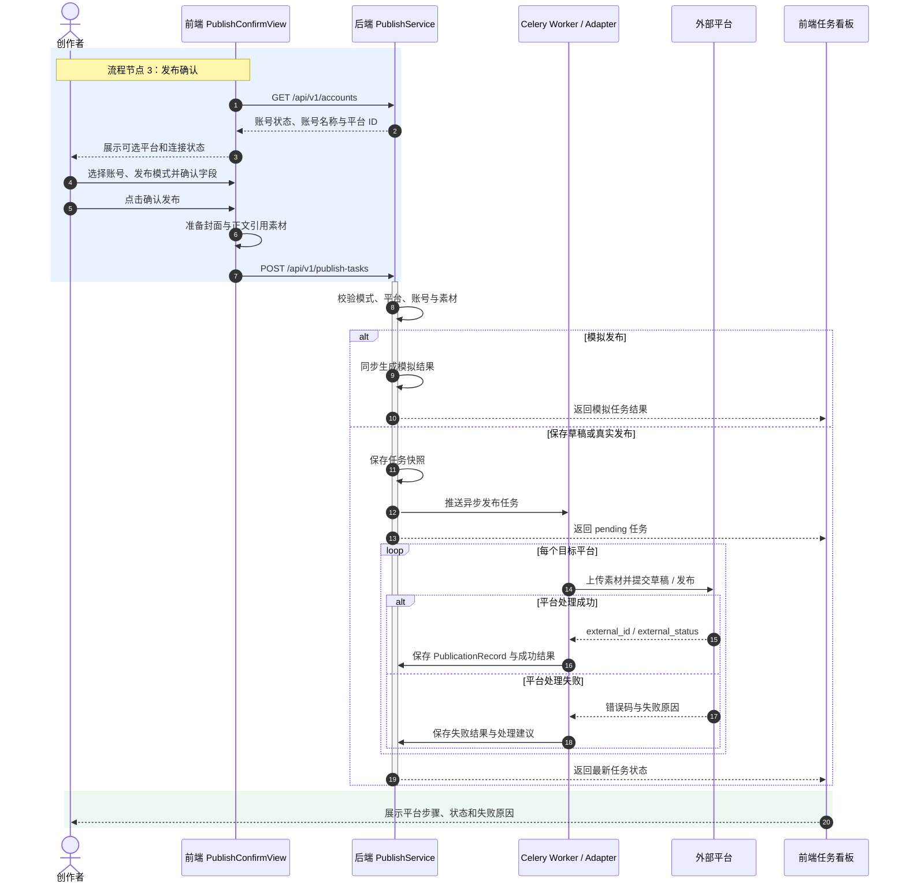

# 发布确认 —— 业务流程图

> 描述从用户确认发布到平台真实发布完成的前后端通讯过程。

---

## 泳道图

---

## 步骤详解

### Step 1：进入发布确认页

用户完成预览后进入「发布确认」页。页面加载时请求 `GET /api/v1/accounts` 获取各平台账号状态，据此过滤可选平台：模拟模式全平台可选，真实发布仅已连接账号的平台可选。

### Step 2：配置发布字段

两种配置方式：

| 方式 | 说明 |
|------|------|
| **统一配置** | 全局标题/摘要同步到所有平台，各平台只填专属字段（如 B站分区、公众号作者） |
| **独立配置** | 各平台独立编辑标题/正文/摘要/标签，默认值由 Agent 生成的 draft 填充 |

### Step 3：提交发布任务

前端将草稿快照、平台配置、账号ID、素材ID 合并为 Payload，发送 `POST /api/v1/publish-tasks`。草稿快照不依赖 `previews` 表外键，用户关闭页面后任务仍可执行。

### Step 4：后端处理

- **模拟模式**：直接同步返回各平台假结果，不入队列。
- **真实发布**：创建 `PublishTask` 记录 → 校验账号凭据 → 推送 Celery 队列。

### Step 5：异步发布到平台

Celery Worker 拉取任务，逐平台调用 Adapter 执行真实发布：

| 平台 | 核心流程 |
|------|---------|
| 公众号 | 获取 access_token → 上传素材 → 创建草稿（draft）/ 提交发布（publish） |
| B站 | Cookie 鉴权 → 上传视频分片 → 上传封面 → 提交稿件 |
| 小红书 | 签名认证 → 上传图片/视频 → 创建笔记 |

每平台发布完成后保存 `PublicationRecord`（external_id、external_url、响应结果）。全平台成功 → 任务状态 `succeeded`，任一失败 → `failed`。

### Step 6：前端任务看板

`TaskView` 展示任务列表，每条任务显示各平台步骤时间线（上传→创建→发布），支持刷新状态、草稿转发布等操作。

---

## 三种发布模式

| 模式 | 调用平台API | 异步执行 | 用途 |
|------|:---:|:---:|------|
| `simulate` | ❌ | ❌ | 演示/测试工作流 |
| `draft` | ✅ 创建草稿 | ✅ Celery | 公众号预览后人工确认再发布 |
| `publish` | ✅ 直接发布 | ✅ Celery | 正式发布 |

---

## 关键设计决策

| 决策 | 原因 |
|------|------|
| 草稿快照保存在任务中 | 不依赖 previews 外键，离线可靠执行 |
| 用户确认优先 | 发布前可覆盖 Agent 生成字段 |
| Celery 异步 | 视频上传耗时长，不阻塞 API 响应 |
| 凭据加密存储 | AppSecret/Cookie 加密入库，仅发布时解密 |

---

> **相关文档**：[生成预览流程图](./preview-flow.md) · [账号登录流程图](./account-flow.md) · [API 契约](./api-contract.md) · [发布字段映射](./publish-field-mapping.md)
