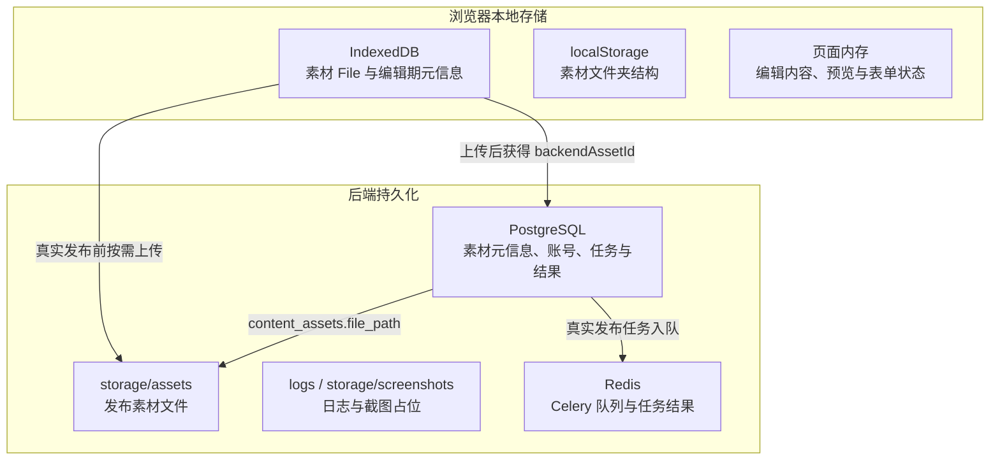
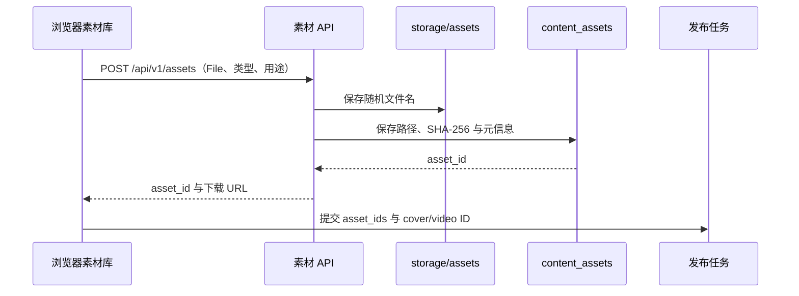

# 数据与素材存储设计

> 本文说明 Auto_Upt 当前各类数据保存在哪里、素材如何从浏览器进入真实发布链路，以及备份和清理时需要注意的边界。

## 1. 存储分层



| 数据类型 | 保存位置 | 是否跨浏览器/设备 | 主要用途 |
|---|---|:---:|---|
| 编辑期素材文件 | 浏览器 IndexedDB：`auto-upt-media-library/assets` | 否 | 素材库预览、正文插入和编辑 |
| 素材文件夹结构 | 浏览器 localStorage：`auto-upt-media-folders` | 否 | 素材库分类展示 |
| 当前编辑内容和页面状态 | Vue 页面内存 | 否 | 当前会话中的编辑、预览和发布确认 |
| 发布素材文件 | 后端 `storage/assets/` | 是，取决于部署存储 | 供异步任务和平台 Adapter 使用 |
| 发布素材元信息 | PostgreSQL `content_assets` | 是 | 保存素材 ID、路径、类型、大小和摘要 |
| 账号、Agent 运行、发布任务与结果 | PostgreSQL | 是 | 业务持久化和任务恢复 |
| 异步任务消息与结果 | Redis | 临时 | Celery Broker 和结果后端 |
| 本地脚本日志 | `logs/` | 是，取决于部署存储 | 后端与 Worker 排查 |
| 模拟截图路径 | `storage/screenshots/` | 是，取决于部署存储 | 当前主要保存截图占位路径 |

## 2. 浏览器素材库

前端素材类型定义为 `LocalAsset`，包含：

- 浏览器素材 ID `id`；
- 原始 `File`；
- 浏览器对象 URL `previewUrl`；
- 素材类型、名称、大小和文件夹信息；
- 上传后才会出现的 `backendAssetId`、`backendUrl` 和 `uploadPurpose`。

素材库通过 IndexedDB 保存 `File` 和编辑期元信息。页面重新加载时，会重新创建 `blob:` 预览 URL。

需要注意：

- IndexedDB 数据仅属于当前浏览器和当前站点来源，换浏览器、换域名或清理站点数据后不会自动恢复。
- `blob:` URL 只在当前浏览器会话中有效，外部平台无法访问。
- 文件夹结构保存在 localStorage，不是后端数据库记录。
- 当前封面选择不会作为独立 localStorage 状态长期保存，重新进入时需要根据当前页面状态重新确认。

## 3. 后端发布素材

真实发布前，前端通过 `POST /api/v1/assets` 按需上传素材。后端会：

1. 在 `ASSET_STORAGE_DIR` 指定目录创建文件；
2. 使用随机 UUID 文件名保存，保留原始扩展名；
3. 计算文件大小和 SHA-256；
4. 在 `content_assets` 中保存素材元信息；
5. 返回 `asset_id` 和下载 URL；
6. 前端将返回值写入对应 `LocalAsset.backendAssetId`，后续可复用。



后端素材下载 URL 为：

```text
{PUBLIC_BASE_URL}/api/v1/assets/{asset_id}/download
```

公众号 Adapter 会读取后端本地文件并上传到微信。小红书 Adapter 会使用基于 `PUBLIC_BASE_URL` 的素材 URL，因此该地址必须能被外部平台访问，不能使用浏览器 `blob:` URL 或仅容器内部可访问的地址。

## 4. 正文素材引用

正文可以通过素材标记引用浏览器素材：

```text
{{asset:image:<token>}}
{{asset:video:<token>}}
{{asset:audio:<token>}}
```

前端会把正文标记转换为 `content_blocks`，其中素材块使用浏览器素材 ID：

```json
{
  "type": "asset",
  "asset_id": "browser-asset-id",
  "asset_kind": "image",
  "role": "inline"
}
```

创建真实发布任务前，前端上传相关素材并取得后端 `asset_id`。发布任务通过 `asset_ids.<platform>`、平台选项中的封面/视频 ID，以及内容 IR 中发现的素材引用加载后端素材。

浏览器素材 ID 与后端素材 ID 不是天然相同的值，不能直接把只存在于 IndexedDB 的素材 ID 当作真实发布素材 ID。

## 5. Docker 持久化

当前 Compose 挂载关系：

| 宿主机/卷 | 容器路径 | 内容 |
|---|---|---|
| `./storage` | `/app/storage` | 后端素材与截图目录 |
| `./logs` | `/app/logs` | 后端和 Worker 日志 |
| Docker 卷 `postgres_data` | `/var/lib/postgresql/data` | PostgreSQL 数据 |

`backend` 和异步发布任务执行器共享 `./storage`，因此 Worker 能读取 API 上传的素材文件。

Redis 当前未配置持久化卷。Redis 重启可能丢失尚未消费的 Celery 消息和任务结果，但已写入 PostgreSQL 的业务记录不会因此删除。

## 6. 删除与一致性

调用 `DELETE /api/v1/assets/{asset_id}` 会删除：

- `content_assets` 中的素材记录；
- `file_path` 指向的后端本地文件。

当前数据库没有从发布任务到 `content_assets` 的素材外键。`publish_tasks.asset_ids` 和草稿快照只保存逻辑 ID，因此删除仍被任务引用的素材可能导致后续真实发布失败。

同样，删除浏览器素材不会自动删除已经上传到后端的素材；删除后端素材也不会自动清除浏览器 IndexedDB 中的副本。

## 7. 备份与恢复

完整备份至少应包含：

1. PostgreSQL 数据库或 Docker 卷 `postgres_data`；
2. 项目根目录 `storage/`；
3. 需要保留的 `logs/`；
4. 当前 `CREDENTIAL_ENCRYPTION_KEY` 的安全副本。

浏览器 IndexedDB 和 localStorage 不包含在服务器备份中。如需跨设备恢复编辑期素材，应先实现素材库后端化或专门的导出/导入功能。

恢复时必须同时恢复数据库与 `storage/assets`。仅恢复数据库会留下指向不存在文件的 `content_assets.file_path`；仅恢复文件目录则缺少可查询的素材记录。

`CREDENTIAL_ENCRYPTION_KEY` 一旦丢失或更换，已有账号凭据无法解密。

## 8. 当前限制与改进方向

- 编辑期素材主要保存在浏览器，不能天然跨设备共享。
- 浏览器素材、后端素材和发布任务之间缺少统一的生命周期管理。
- `content_assets.sha256` 已建立索引，但当前上传逻辑不会按摘要自动去重。
- 发布任务通过 JSON 保存素材 ID，没有数据库外键阻止误删。
- Redis 未配置持久化，不能作为业务事实来源。
- 后续可增加素材引用计数、孤立素材清理、后端素材库同步和导出/导入能力。

> 相关文档：[数据库模型](./database-schema.md) · [发布确认字段映射](./publish-field-mapping.md) · [发布确认流程](./publish-flow.md) · [API 契约](./api-contract.md)

